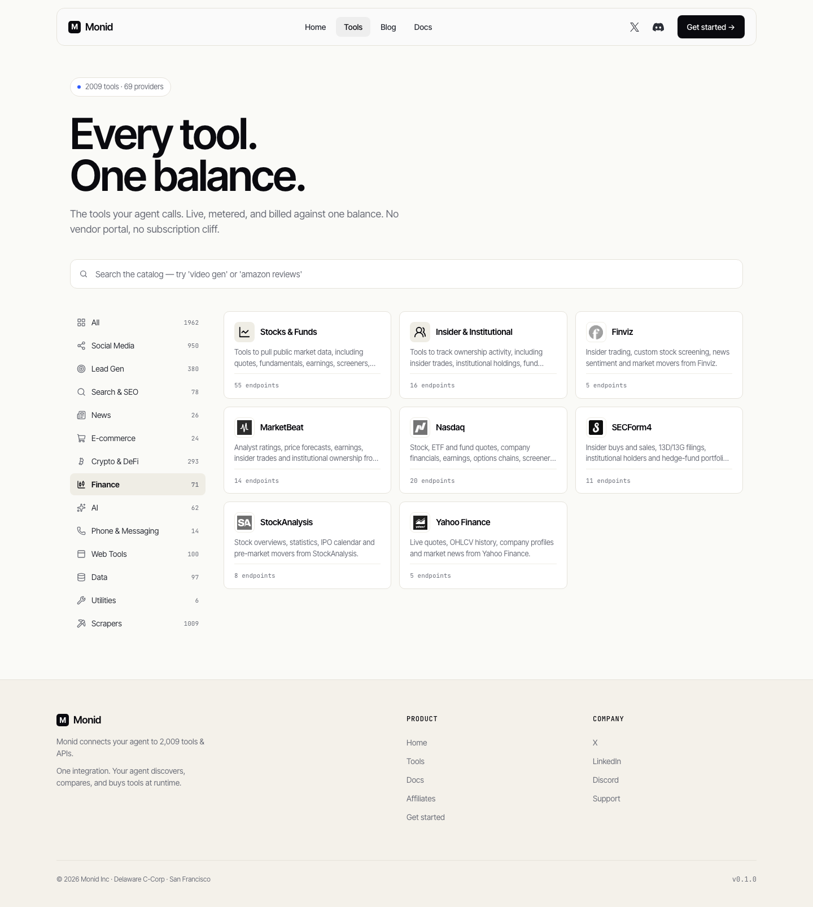

# Monid and Data Integrations for the Investment Platform

## Decision brief

**Monid is useful as a shared, metered gateway for selected research APIs. It is not an established substitute for a licensed market-data or news feed.** Its documentation supports embedding tools in another product, including server-side access, customer OAuth and a controlled proxy. Endpoint suitability still depends on the underlying source, output quality, cost and applicable rights.[^monid-integration]

The recommended shortlist is **Context.dev for company-news discovery**, **Akta for richer company and macro signals**, and **DefiLlama equities for a low-cost financial-data evaluation**. These are actual Monid listings. **Quartr and Fiscal.ai are direct-provider alternatives**, with stronger documented paths to an explicitly licensed customer product. Quartr is the preferred new feature if live earnings research is the priority; Fiscal.ai is the preferred alternative for financial figures linked to their source filings.

No candidate is established here as providing a free, unrestricted, customer-facing news reader. A paid API, a personal subscription and a publisher-content licence are different products. A suitable published licence can itself authorize use without a separate permission email; additional agreement is needed where the proposed use exceeds the grant or the grant remains unclear.

| Priority | Candidate and route | Concrete customer benefit | Decision condition |
| --- | --- | --- | --- |
| First news evaluation | Context.dev, listed on Monid | Better company matching, fewer duplicate stories, clearer source cards | Confirm customer-display scope; measure relevance and coverage |
| Richer news alternative | Akta, listed on Monid | Company, sector and macro event feeds with summaries and classifications | Internal-only standard terms; external product and publisher rights need agreement |
| First separate feature | Quartr, direct provider | An earnings room with audio, transcripts, slides and cited analysis | API redistribution quote and approved product scope |
| Financial research alternative | Fiscal.ai, direct provider | Click a financial figure to inspect its source filing; compare company KPIs | External-use order form, coverage and export restrictions |
| Conditional low-cost data test | DefiLlama equities, listed on Monid | Company charts, statements and links to filings | Beta feed; Twelve Data provenance and downstream display rights |
| Later experiment | Gloria, listed on Monid | Crypto/social context beside prediction-market movements | Commercial permission, source verification and score validation |
| Free source foundation | SEC EDGAR, direct source | Official filing and insider-disclosure alerts | Compliant access and reliable ingestion; US reporting scope |

These priorities are product assessments. Public listings and documentation were inspected on **9 September 2026**; authenticated data delivery, paid subscriptions, contracted latency and commercial entitlements were not tested. No integration has been implemented as part of this assessment.

## What Monid actually provides

Monid exposes a discovery, inspection and execution API with a common prepaid wallet. It also offers MCP and CLI access. Pricing can be per call, per returned item or another unit; per-result prices can include a base charge. Its public homepage describes a 10% markup over underlying provider prices. The calculations below use the catalogue's displayed customer prices without adding another 10%; the final billing treatment should be checked in a permitted trial.[^monid-how], [^monid-home]

The finance category advertises **71 endpoints**, but pagination returned **70 unique listings across seven provider labels**. StockAnalysis advertises eight and exposes seven. The broader site displayed 2,009 tools and 69 providers. These are catalogue counts, not numbers of distinct financial datasets or independently verified commercial partnerships.[^monid-catalogue]

| Finance label | Retrievable endpoints | Data advertised in the listings | Listed USD cost |
| --- | ---: | --- | --- |
| Nasdaq | 20 | Quotes, financials, earnings, dividends, options, holdings and market discovery | \$0.01/call |
| MarketBeat | 14 | Earnings, statements, ratings/forecasts, company headlines, options and ownership | \$0.01–\$0.02/call |
| SECForm4 | 11 | Insider transactions, issuer/owner histories and activity lists | \$0.01/call |
| DefiLlama | 8 | Equity universe, statements, filings, summary, price history, OHLCV, on-chain exposure and dimensions | \$0.00060/call |
| StockAnalysis | 7 | Company financial and stock-research data | \$0.01/call |
| Finviz | 5 | Screener, insider activity, sector performance, news sentiment and movers | \$0.01/call |
| Yahoo Finance | 5 | Quotes, historical prices, company information and news | \$0.05/call |

The separate news category returned **26 listings**, including company enrichment and social-content utilities. It includes Context.dev, Akta, TinyFish, Surf, Gloria, Apollo, Apify and TikHub. A category label does not establish that every item is a financial-news service. The accompanying workbook and CSV preserve every captured finance/news endpoint, its provider ID, price model and evidence URL.[^monid-news]

Every captured finance listing carries a “verified” tag. The public inspection reference documents the tag but does not define a content-licensing guarantee. No Monid terms or privacy agreement was located through the reviewed public footer, documentation, unauthenticated application landing page or common legal paths. That is an unresolved evidence gap, not proof that no terms or distribution agreements exist.[^monid-inspect]

For the familiar finance website names, public catalogue metadata did not establish who operates the connector or whether the named publisher authorizes redistribution through Monid. Some endpoints may be licensed integrations; others may retrieve website data. The label alone cannot distinguish these arrangements.

## Match to the current platform

The existing product already has company pages, holdings, news feeds, Global News 2, alerts, a research assistant, a configurable research pipeline and a Polymarket page. Another general quote or AI-summary widget would add limited value. The stronger additions connect new source material to these existing workflows.

The current news service uses shared ingestion, PostgreSQL, source adapters, conservative company matching, revisions and rights metadata. The catalogue import has 1,515 listing rows, which must not be equated with 1,515 unique issuers. Growth to 10,000–50,000 companies requires a persistent issuer/security identity map and collection shared across portfolios. The current free Global News 2 evidence contains central-bank releases; it does not demonstrate broad, fresh journalism for the company catalogue.

The architecture audit still has unresolved production issues, including provider-entitlement concurrency and provider cursor handling. Customer authentication, tenant isolation and contractual access enforcement need completion before a paid multi-customer release. Adding a provider would not resolve those issues. These observations reflect the existing architecture and review records, not a new production-readiness certification.

| Existing surface | Useful proposed addition | Information the interface should preserve |
| --- | --- | --- |
| All News / My Stocks / company page | Company-focused stories grouped by event | Publisher, original time, match reason, source type, corrections |
| Catalogue / My Stocks | Earnings, dividends and filing calendar | Expected versus confirmed dates; event and filing identifiers |
| Research assistant / strategy pipeline | Source-linked earnings and financial evidence | Original document/timestamp, units, period and AI interpretation label |
| Polymarket | Related source events and optional experimental context | Market identity, source time, price time and analysis time separately |

## Actual Monid candidates

### Context.dev: strongest focused news-discovery evaluation

The official news endpoint accepts company names, domains, tickers or ISINs. Its response documents article and story IDs, publisher information, publication time, a description, image URL and matching confidence. Publisher-domain, language, country, article-type and date filters plus cursor pagination support a controlled discovery feed. **No full article body is documented in this endpoint.**[^context-api]

The proposed feature is a better company-news card: group syndicated articles, show why the story matches a holding, and separate company-focused coverage from incidental mentions. Domain/ISIN inputs are promising for ambiguous names and multiple listings, but accuracy across the international catalogue remains unmeasured. Neither a confidence score nor a “direct” source flag proves factual accuracy or publisher permission.

Monid lists **\$0.00009 per returned result**. Direct Context offers **500 free testing credits/month**; paid plans start at **\$25/month for 10,000 credits**, with news charged at one credit per ten results. These are separate purchasing routes; minimum charges, quotas and contractual scope should be compared explicitly.[^context-price]

Its responsible-use documentation says API access does not grant rights to the underlying content or assets. Public general terms limit the standard grant to personal/internal purposes and require permission for other commercial exploitation; an automated-access clause also needs reconciliation with the API product. An API-specific agreement or documented Monid downstream grant must settle customer display, descriptions, images and retention.[^context-use], [^context-terms]

**Assessment:** prioritise a bounded relevance and rights evaluation against the existing Benzinga, Marketaux and Finnhub adapter capabilities. Require demonstrably better company matching or useful additional coverage, with an approved publisher/source list. It could improve discovery cheaply; it does not by itself supply the detailed internal article reader.

### Akta: richer company, industry and macro-event data

Akta by Wokelo documents company and topic news with full text, AI summaries, sentiment, event classifications, company UUIDs/domains, primary-mention flags, industry codes and related entities. The current direct endpoint is `GET /api/v1/news`; Monid exposes its own `/v1/news` identifier. Company, industry and open-ended topic queries make it relevant to both holdings and global macro coverage.[^akta-api], [^akta-overview]

A proposed “Events affecting my portfolio” view could connect a tariff announcement, a supplier development or a company release to affected holdings. The UI should separate direct mentions from inferred exposure. Akta's advertised 20M+ entities include private companies: this is not evidence of accurate coverage for 50,000 listed companies, their securities or every jurisdiction.[^akta-product]

Published example records already illustrate why validation matters: some marketing-page examples have missing publisher names, while API examples contain overlapping classifications and text with site boilerplate. These examples establish schema richness, not a clean production feed. Vendor rankings and accuracy percentages should not replace a representative local benchmark.[^akta-signals]

The captured Monid price is **\$0.005 per call plus \$0.0005 per article**. The visual card shows only the article price; its public metadata includes the base fee. Direct pay-as-you-go credits produce the same base arithmetic: \$0.05/credit, 0.1 credit/call and 0.01 credit/article. Direct documented rate limits are 100 requests/minute for pay-as-you-go and 200 for subscription; they are not confirmed Monid limits.[^akta-price], [^akta-rates]

Akta's May 2026 terms explicitly permit internal business workflows, subject to their restrictions. They do not authorize a general customer-facing news product. They also state that Wokelo does not own publisher content and prohibit raw-content redistribution without the rights holder's consent. Competing-product and AI-training restrictions require attention for a news-intelligence platform; a separate MSA can supersede the standard terms.[^akta-terms]

**Assessment:** the richer news candidate, with a larger contractual hurdle. A signed external-use scope must cover summaries and classifications as well as any full text; paying for raw text is insufficient to make an in-platform reader lawful.

### DefiLlama equities: inexpensive, but beta and dependent on third-party data

All eight captured Monid equity paths match DefiLlama's official API documentation. The official equities section identifies the product as **beta** and attributes the data to **Twelve Data**. This verifies that the paths exist as a provider product; it does not verify Monid's downstream rights.[^llama-api]

The proposed feature is an on-demand company snapshot with statements, filing metadata and links to original documents, and historical charts. Short-window chart data uses five-minute bars; intraday coverage is best effort and may fall back to daily bars. The on-chain exposure dataset is an hourly snapshot for US-listed companies. A “live” summary and a recent fetch time do not establish exchange-grade real-time coverage for every instrument.

Monid lists **\$0.00060/call**. Direct DefiLlama API access lists **\$300/month or \$3,000/year**, one million monthly calls and \$0.60 per thousand additional calls. Its \$49 Pro product excludes API access. Current public terms restrict commercial exploitation and republication without permission, so the route needs an explicit customer-display grant and clarity on Twelve Data conditions.[^llama-price], [^llama-terms]

**Assessment:** worthwhile as a coverage/cost comparator after rights are established. Do not replace the platform's price feed based on price alone.

### Finviz, Nasdaq, MarketBeat, SECForm4, StockAnalysis and Yahoo

These listings suggest useful calendar, screener and insider-alert features. They overlap existing quote/fundamental functionality and are weaker candidates for dependable full-text news. SECForm4 is a third-party website label, not the SEC itself.

Finviz does have an official Elite API/export product. Elite lists \$39.50/month or \$299.50/year for a single user; its API-use materials describe personal use. This cannot be treated as a licence for a shared customer platform. Current free stock quotes are described as one minute delayed; the Elite FAQ and site footer disagree on futures delays, which should remain unverified here.[^finviz-elite], [^finviz-api], [^finviz-faq]

Yahoo's official help expressly prohibits redistribution of information supplied through Yahoo Finance and explains that delays depend on the market. Monid could have a separate arrangement, but no such arrangement was established from its public listing.[^yahoo]

**Assessment:** retain specific endpoints in the inventory, but defer a customer integration until operator, licensing, freshness and supported securities are documented. For insider disclosures, compare against original SEC filings before selecting a convenience wrapper.

### Gloria and the remaining news listings

Gloria's official MCP implementation describes AI processing of 100+ curated Twitter/X accounts across crypto and macro topics. It claims news delivery about two to three minutes after the source post. Monid also lists headline-to-Polymarket scoring. These are useful research signals, but social-source summaries and model scores are not an official company-news feed or validated investment conclusions.[^gloria-code]

Prices include \$0.033/news call, \$0.0341/ticker-summary call and \$0.11/Polymarket-scoring call. Its public terms cover APIs and restrict commercial exploitation without permission. A delayed-signal notice observed in its public terminal's frontend code does not establish the delay of Monid's scoring endpoint.[^gloria-terms], [^gloria-terminal]

**Assessment:** a later, clearly labelled experiment alongside source news. Confirm global Polymarket versus Polymarket US market identifiers, source-price provenance, event timestamps and score calibration. The existing Polymarket page uses REST polling; a new AI endpoint would not convert it into a streaming market-data feed.

TinyFish search is listed at zero dollars and can help find source pages, but its listing describes snippets. Its separate `/fetch` is also advertised free and retrieves page text from up to ten URLs. This may help collect permitted primary-source releases, without granting rights to publisher content.[^tinyfish-listing] Apify's Google News listing explicitly uses scraping and costs \$0.006/result. Surf offers crypto-oriented news/feed/detail tools; Apollo provides company-news search; TikHub's Toutiao endpoints include social/article utilities. These are secondary discovery options whose content rights, coverage and quality remain insufficiently established for the core reader.[^monid-news]

## Direct providers worth comparing

These candidates were researched independently; their membership in Monid's captured finance/news catalogue was not established.

### Quartr: preferred new earnings-research feature

Quartr provides company investor-relations material through REST, webhooks and Snowflake: live/archive audio and transcripts, reports, filings, slides and source-linked summaries. Advertised coverage is 16,000+ public companies across 65+ markets. It is a disclosure/earnings source, rather than a broad newswire or stock-price feed.[^quartr-product]

An **Earnings Room** could show portfolio events, play audio, follow the transcript, jump to the source of a summary and compare guidance across periods. Its documented company identifiers support exchange/ticker pairs, CIK, ISIN and OpenFIGI. Transcript refinements must replace earlier text when appropriate.[^quartr-companies], [^quartr-live]

Published timing commitments distinguish datasets: 90% of live content within five seconds of event start, 95% of archive transcripts within 45 minutes after the call, and 90% of reports within 15 minutes of publication. Snowflake refreshes daily. These are provider commitments, not measured end-to-end platform performance.[^quartr-data]

Commercial API pricing requires a quote. Quartr publishes distinct internal and redistribution contracts; the latter permits an approved product and authorized users. Default restrictions cover caching, competing products and model training/fine-tuning/evaluation. Its limited exception for authorized users passing inputs to AI services that neither retain them nor use them for model training should be checked against the actual backend assistant workflow.[^quartr-terms]

**Assessment:** strongest differentiated feature with a documented route to customer redistribution. Agree audio playback, search indexing, transcript retention, permitted AI analysis and removal handling in the order form.

### Fiscal.ai: preferred source-linked financial dashboard

The current API product advertises 13,000+ public companies. It includes statements, metrics, ownership and financial figures linked to filing images/PDFs. API coverage must not be confused with larger historical terminal universe claims. Company-specific KPIs cover the largest 2,300 companies; quotes are EOD or 15 minutes delayed.[^fiscal-product], [^fiscal-docs]

The proposed feature is a financial chart where selecting a figure opens its source filing, period, units and currency. News returns briefs and source URLs, without a documented full article body or article image.[^fiscal-reference] News history starts 29 April 2026. The newer IR collection is English-language earnings material, with best-effort capture of each company's latest period as of 7 July 2026 and subsequent collection; it is not an established deep global transcript archive.[^fiscal-docs]

An API trial covers 100 specified companies and 250 calls/day. Production webhooks can notify financial, news and IR changes. No current numeric commercial API price was verified.[^fiscal-trial], [^fiscal-webhooks]

The current API terms, version 2026:8 dated 17 August 2026, allow permissioned internal/external use through an order form. Defaults prohibit unauthenticated display and end-user downloading/copying/redistribution. Authorized application AI outputs are contemplated, while model training requires written approval; attribution choices affect fees. Older cached terms and terminal subscription prices should not be used to budget this integration.[^fiscal-terms]

**Assessment:** a strong alternative when auditable company numbers matter more than live calls. Confirm coverage, source-image rights, restatements, customer authentication and exports before adoption.

### NewsCatcher, NewsAPI.ai, Feedly and FMP

| Direct comparator | Potential role | Current cost evidence | Limitation for this platform |
| --- | --- | --- | --- |
| NewsCatcher News API | Multilingual filtering, entities, clusters and news enrichment | Production News API requires an enterprise quote; \$50/\$500 CatchAll prices are a different product | Standard API conditions limit use to internal purposes and leave copyright clearance with the customer |
| Event Registry / NewsAPI.ai | Multi-source event timelines and topic clustering | \$90/month for 5K tokens; article/event/archive queries have different token costs | Terms restrict redistribution and competing aggregation/event-detection products without authorization |
| Feedly Market Intelligence | Optional enterprise analyst workspace | Advanced with API: \$2,400/month billed annually | Internal authorized users; no underlying publisher-content licence |
| Financial Modeling Prep | Broad calendar, price and fundamental-data comparator | Commercial quote required; personal plans do not price company use | Specific display/licensing agreement required |

These findings are supported by the providers' pricing and contract pages.[^newscatcher-price], [^newscatcher-terms], [^newsapiai-plans], [^newsapiai-terms], [^feedly-price], [^feedly-terms], [^fmp-price], [^fmp-terms]

NewsCatcher is the strongest enterprise news-enrichment comparator. NewsAPI.ai offers useful event-evaluation economics, but its competition clause directly matters to the proposed feature. A customer's Feedly account or publisher subscription does not automatically authorize embedding all content through this platform. None of these ordinary subscriptions should be represented as blanket permission for a free full-article reader.

### SEC EDGAR: strengthen the free official-source layer

SEC submissions and XBRL reading APIs require no API key or subscription. They expose filing histories, issuer metadata and reported financial facts; nightly bulk archives support large-scale retrieval. The SEC reports typical processing delays below one second for submissions and below one minute for XBRL, with longer delays possible at peak times. These are processing delays after dissemination, not transaction-time coverage.[^sec-api]

An insider-alert feature should parse original ownership filings and distinguish transaction date, filing date, transaction code, amendments and issuer versus reporting-owner identity. A filed ownership report is not proof that a transaction occurred moments ago. Access is subject to SEC fair-access rules, including an aggregate ceiling of ten requests/second and an identifiable client. The current local service has experienced SEC 403 responses; reliable connectivity still needs resolution through compliant access.[^sec-dev]

**Assessment:** best free primary-source foundation for US reporting companies. It does not cover worldwide company journalism or grant blanket reuse rights over every third-party exhibit contained in a filing.

## Costs at catalogue scale

The following are arithmetic scenarios using captured Monid prices, **not commercial quotes or measured coverage**. They exclude tax, hosting, storage, LLM processing, content/image rights, retries and other endpoints. Repeated results may be billed again. A cheaper unit is not necessarily a cheaper complete feature.

| Illustrative workload | Calculation | Endpoint cost |
| --- | --- | ---: |
| Context, 100,000 returned results | 100,000 × \$0.00009 | \$9 |
| Akta, 100,000 articles across 1,000 calls | 100,000 × \$0.0005 + 1,000 × \$0.005 | \$55 |
| DefiLlama, 100,000 calls | 100,000 × \$0.0006 | \$60 |
| Finviz/Nasdaq, 100,000 calls | 100,000 × \$0.01 | \$1,000 |
| Yahoo Finance, 100,000 calls | 100,000 × \$0.05 | \$5,000 |
| Gloria, 1,000 Polymarket-scoring calls | 1,000 × \$0.11 | \$110 |

For a single endpoint called once per company, every day of a 30-day month:

| Monitored entities | Calls/month | At \$0.0006/call | At \$0.01/call | At \$0.05/call |
| --- | ---: | ---: | ---: | ---: |
| 1,515 | 45,450 | \$27.27 | \$454.50 | \$2,272.50 |
| 10,000 | 300,000 | \$180 | \$3,000 | \$15,000 |
| 50,000 | 1,500,000 | \$900 | \$15,000 | \$75,000 |

Polling every 15 minutes multiplies the daily scenario by 96. At 50,000 companies, this means **4.8 million requests/day** and **\$1.44 million/month at \$0.01/call**, before pagination. There is no product justification for repeatedly checking slowly changing statements at that frequency. Shared incremental feeds, bulk imports, event notifications and cached on-demand research are the appropriate design.

## Proposed integration design, subject to selection

Use the existing news-service boundary for collection and rights enforcement. For Monid, start with a fixed allowlist of selected endpoints and a server-held key; expose domain-specific functions to the UI and research assistant. Monid documents this curated pattern and also permits a proxy to validate requests, restrict endpoints and control billing. OAuth is an option when users bring their own Monid workspace; it still does not establish their content licence.[^monid-direct], [^monid-proxy]

Separate the legal grant to call a service from the fields allowed to appear in a customer response. Store provenance, contract scope, publisher, original publication time, provider update time, fetch time, licence expiry, image permission and deletion status. A valid account or a HTTP 200 response must not override a revoked entitlement.

Acquire once and associate locally to the issuer/security master. Track ticker plus exchange, issuer identifiers, domains, subsidiaries, languages and listing changes. Feed company pages and portfolios from those associations. Use source and event IDs for deduplication; syndicated reporting from one origin must not be counted as independent confirmation.

The reader should show full bodies, photos and translations only within the applicable grant. Otherwise provide a licensed brief and source link, using supported embedded reading only where the publisher permits it. A free-to-read web page or a user's paid subscription does not automatically make republishing or embedding permissible. An absent image should remain absent rather than become a misleading event illustration.

For research agents, send only the data needed by the approved endpoint. Customer holdings, strategies and uploaded documents should not be forwarded as incidental context. Limit maximum returned items, concurrency, daily spending and expensive retries. Retrieved news is untrusted input to an assistant, not instructions to buy tools or change permissions.

Monid can return synchronous results or asynchronous run IDs. A completed run may contain a provider error, and a blocked run can arrive with HTTP 200. Production handling must inspect the run state and provider response, preserve cursors across partial failures and reconcile actual billed units. The public documentation does not establish idempotent retry guarantees or a uniform rate limit across all providers.[^monid-run]

## Evaluation and commercial decision

The next step is a **selected, bounded evaluation**, after the product direction and applicable evaluation rights are agreed. It should not connect every available Monid endpoint to the live MVP.

| Check | Proposed evidence required |
| --- | --- |
| Representative coverage | About 100 issuers across exchanges, sizes and languages; duplicate listings and ambiguous company names included |
| Relevance | Human-labelled sample separating principal subject, material secondary exposure and incidental mention; proposed precision target at least 95% for principal-subject cards |
| Freshness | Original publication, provider ingestion and platform display times; median and 95th percentile per source; no universal “real-time” label |
| Completeness | Missing bodies/images, pagination gaps, duplicates, historical depth and unsupported issuers quantified |
| Accuracy | Prices with venue/currency/time; filing numbers checked for units and restatements; AI summaries checked against original evidence |
| Operations | Rate limits, timeout/retry costs, updates, corrections, takedowns and deletion after access revocation |
| Customer rights | Exact fields, audience, authenticated/public display, images, retention, search indexes, derived outputs, LLM processing and exports |

The 95% figure is a proposed acceptance target, not a measured provider result. Coverage denominators should be matched issuers, not the number of available tickers or a provider's global marketing total.

For Monid, the commercial questions are its terms and data-processing agreement, endpoint operator identity, any provider/publisher distribution grant, allowed downstream uses, final billing units, failed/repeated-call charges, volume limits and removal obligations. Separate direct-provider negotiations should compare the same scope, rather than compare a consumer subscription with an enterprise redistribution quote.

The recommended choice is **Context.dev first if the goal is better news relevance**, **Quartr first if the goal is a differentiated premium feature**, or **Fiscal.ai first if source-backed financial analysis is the priority**. Akta merits a parallel commercial-scope discussion for richer news. Retain SEC and other appropriate primary sources as the free foundation. Keep Gloria optional, and defer the website-labelled finance connectors until their operating and licensing arrangements are clear.

## Evidence and limitations

The attached inventory contains the complete captured set of 70 finance listings and 26 news-category listings, not an exhaustive verification of all 2,009 Monid tools. Public listing metadata was retrieved successfully; authenticated `inspect`/`run` calls and paid provider outputs were not executed. Screenshots show actual public listings. Sample response fields discussed above come from official documentation, not a live customer feed.

Current public contract pages were checked where retrievable, including browser-rendered Akta and Fiscal.ai terms. Missing Monid contractual information remains explicitly unresolved. No vendor was contacted, no account was created and no code, provider connection or subscription was changed. The recommendations are conditional on contract scope and measured fit, not assurances of complete coverage, content accuracy or legal clearance.

*Actual public catalogue screenshot, 9 September 2026. Category/group totals overlap; the finance count discrepancy is documented above. These are endpoint listings, not a demonstration of successful paid data retrieval.*

## Sources

Sources are original provider, publisher or regulator materials. Catalogue pricing is a point-in-time observation; contract-specific grants and future pricing may differ.

1. [Monid, Integrations Overview](https://monid.ai/docs/integrations/overview). Accessed 9 September 2026.
2. [Monid, How It Works](https://monid.ai/docs/guide/how-it-works). Accessed 9 September 2026.
3. [Monid, public homepage and pricing FAQ](https://monid.ai/). Accessed 9 September 2026.
4. [Monid, finance catalogue and public listing metadata](https://monid.ai/tools?c=finance). Accessed 9 September 2026.
5. [Monid, news catalogue and public listing metadata](https://monid.ai/tools?c=news). Accessed 9 September 2026.
6. [Monid, Inspect API reference](https://monid.ai/docs/api/inspect). Accessed 9 September 2026.
7. [Context.dev, Search Company News API](https://docs.context.dev/api-reference/news/search). Accessed 9 September 2026.
8. [Context.dev, current pricing and credit schedule](https://www.context.dev/pricing). Accessed 9 September 2026.
9. [Context.dev, responsible use and content rights](https://docs.context.dev/optimization/fair-use). Accessed 9 September 2026.
10. [Context.dev, Terms of Service](https://www.context.dev/term). Accessed 9 September 2026.
11. [Akta, News Signals API reference](https://docs.akta.pro/api-reference/news-signals). Accessed 9 September 2026.
12. [Akta, News Signals API overview](https://docs.akta.pro/docs/news-signals/overview). Accessed 9 September 2026.
13. [Akta, company data and signals product](https://akta.pro/). Accessed 9 September 2026.
14. [Akta, News and Signals product and public examples](https://akta.pro/news-signals). Accessed 9 September 2026.
15. [Akta, API pricing](https://docs.akta.pro/getting-started/pricing). Accessed 9 September 2026.
16. [Akta, API rate limits](https://docs.akta.pro/getting-started/rate-limits). Accessed 9 September 2026.
17. [Akta by Wokelo, Terms and Conditions, 11 May 2026; browser-rendered page](https://akta.pro/legal?tab=terms). Accessed 9 September 2026.
18. [DefiLlama, official Pro API reference: equities beta and Twelve Data attribution](https://github.com/DefiLlama/api-docs/blob/main/llms-pro.txt). Accessed 9 September 2026.
19. [DefiLlama, Pro API plans and quotas](https://docs.llama.fi/pro-api). Accessed 9 September 2026.
20. [DefiLlama, Terms of Use, effective 24 June 2025](https://defillama.com/terms). Accessed 9 September 2026.
21. [Finviz, Elite plans and single-user licence](https://elite.finviz.com/elite). Accessed 9 September 2026.
22. [Finviz, API usage limits; official indexed material, browser verification blocked](https://finviz.com/knowledge-base/market-data-research/api/usage-limits). Accessed 9 September 2026.
23. [Finviz, FAQ and data timing](https://elite.finviz.com/help/faq). Accessed 9 September 2026.
24. [Yahoo Finance, exchanges, data providers and redistribution notice; browser verified](https://help.yahoo.com/kb/SLN2310.html). Accessed 9 September 2026.
25. [CryptoBriefing Labs, official Gloria MCP server source](https://github.com/cryptobriefing-labs/gloria-mcp/blob/main/src/gloria_mcp/server.py). Accessed 9 September 2026.
26. [Gloria, Terms of Use](https://www.itsgloria.ai/terms-of-use). Accessed 9 September 2026.
27. [Gloria terminal; conditional delay notice observed in its public frontend code](https://www.itsgloria.ai/). Accessed 9 September 2026.
28. [Monid, TinyFish public endpoint listings](https://monid.ai/tools/tinyfish). Accessed 9 September 2026.
29. [Quartr, API product and coverage](https://quartr.com/products/quartr-api). Accessed 9 September 2026.
30. [Quartr, company identifiers](https://quartr.com/docs/datasets/companies). Accessed 9 September 2026.
31. [Quartr, live earnings-call transcript delivery and revisions](https://quartr.com/docs/datasets/live-earnings-call-transcripts). Accessed 9 September 2026.
32. [Quartr, data overview and delivery timing](https://quartr.com/docs/data-overview). Accessed 9 September 2026.
33. [Quartr, international API redistribution subscription terms, version 2026:1](https://a.storyblok.com/f/182663/x/0317ec337d/quartr-api-standard-subscription-terms-international-redistribution-2026.pdf). Accessed 9 September 2026.
34. [Fiscal.ai, current API product and company coverage; browser verified](https://fiscal.ai/products/api/). Accessed 9 September 2026.
35. [Fiscal.ai, API introduction, dataset coverage and history](https://docs.fiscal.ai/docs/introduction). Accessed 9 September 2026.
36. [Fiscal.ai, API reference including company/top news and IR resources](https://docs.fiscal.ai/docs/api-reference). Accessed 9 September 2026.
37. [Fiscal.ai, free API trial limits](https://docs.fiscal.ai/docs/guides/free-trial). Accessed 9 September 2026.
38. [Fiscal.ai, webhook guide](https://docs.fiscal.ai/docs/guides/webhooks). Accessed 9 September 2026.
39. [Fiscal.ai, current API Terms, version 2026:8, 17 August 2026; browser verified](https://fiscal.ai/api-terms/). Accessed 9 September 2026.
40. [NewsCatcher, News API pricing; distinguish CatchAll Web Search](https://www.newscatcherapi.com/pricing?tab=news-api). Accessed 9 September 2026.
41. [NewsCatcher, API Terms of Conditions](https://www.newscatcherapi.com/company/legal/terms-of-conditions). Accessed 9 September 2026.
42. [NewsAPI.ai / Event Registry, plans and token rules](https://newsapi.ai/plans). Accessed 9 September 2026.
43. [NewsAPI.ai / Event Registry, terms](https://newsapi.ai/terms). Accessed 9 September 2026.
44. [Feedly, Market Intelligence pricing](https://feedly.com/market-intelligence/pricing). Accessed 9 September 2026.
45. [Feedly, Enterprise Subscription Agreement, July 2026](https://feedly.com/legal/esa). Accessed 9 September 2026.
46. [Financial Modeling Prep, commercial pricing and display licensing](https://site.financialmodelingprep.com/developer/docs/pricing?planType=commercial). Accessed 9 September 2026.
47. [Financial Modeling Prep, Terms of Service](https://site.financialmodelingprep.com/terms-of-service). Accessed 9 September 2026.
48. [SEC, EDGAR reading APIs, timing and bulk archives](https://www.sec.gov/search-filings/edgar-application-programming-interfaces). Accessed 9 September 2026.
49. [SEC, developer resources and fair-access rules](https://www.sec.gov/about/developer-resources). Accessed 9 September 2026.
50. [Monid, curated direct server-side integration](https://monid.ai/docs/integrations/direct/setup). Accessed 9 September 2026.
51. [Monid, proxy integration, billing and endpoint restrictions](https://monid.ai/docs/integrations/proxy). Accessed 9 September 2026.
52. [Monid, Run API states, provider errors and billing](https://monid.ai/docs/api/run). Accessed 9 September 2026.

[^monid-integration]: [Monid, Integrations Overview](https://monid.ai/docs/integrations/overview).
[^monid-how]: [Monid, How It Works](https://monid.ai/docs/guide/how-it-works).
[^monid-home]: [Monid, public homepage and pricing FAQ](https://monid.ai/).
[^monid-catalogue]: [Monid, finance catalogue and public listing metadata](https://monid.ai/tools?c=finance).
[^monid-news]: [Monid, news catalogue and public listing metadata](https://monid.ai/tools?c=news).
[^monid-inspect]: [Monid, Inspect API reference](https://monid.ai/docs/api/inspect).
[^context-api]: [Context.dev, Search Company News API](https://docs.context.dev/api-reference/news/search).
[^context-price]: [Context.dev, current pricing and credit schedule](https://www.context.dev/pricing).
[^context-use]: [Context.dev, responsible use and content rights](https://docs.context.dev/optimization/fair-use).
[^context-terms]: [Context.dev, Terms of Service](https://www.context.dev/term).
[^akta-api]: [Akta, News Signals API reference](https://docs.akta.pro/api-reference/news-signals).
[^akta-overview]: [Akta, News Signals API overview](https://docs.akta.pro/docs/news-signals/overview).
[^akta-product]: [Akta, company data and signals product](https://akta.pro/).
[^akta-signals]: [Akta, News and Signals product and public examples](https://akta.pro/news-signals).
[^akta-price]: [Akta, API pricing](https://docs.akta.pro/getting-started/pricing).
[^akta-rates]: [Akta, API rate limits](https://docs.akta.pro/getting-started/rate-limits).
[^akta-terms]: [Akta by Wokelo, Terms and Conditions, 11 May 2026; browser-rendered page](https://akta.pro/legal?tab=terms).
[^llama-api]: [DefiLlama, official Pro API reference: equities beta and Twelve Data attribution](https://github.com/DefiLlama/api-docs/blob/main/llms-pro.txt).
[^llama-price]: [DefiLlama, Pro API plans and quotas](https://docs.llama.fi/pro-api).
[^llama-terms]: [DefiLlama, Terms of Use, effective 24 June 2025](https://defillama.com/terms).
[^finviz-elite]: [Finviz, Elite plans and single-user licence](https://elite.finviz.com/elite).
[^finviz-api]: [Finviz, API usage limits; official indexed material, browser verification blocked](https://finviz.com/knowledge-base/market-data-research/api/usage-limits).
[^finviz-faq]: [Finviz, FAQ and data timing](https://elite.finviz.com/help/faq).
[^yahoo]: [Yahoo Finance, exchanges, data providers and redistribution notice; browser verified](https://help.yahoo.com/kb/SLN2310.html).
[^gloria-code]: [CryptoBriefing Labs, official Gloria MCP server source](https://github.com/cryptobriefing-labs/gloria-mcp/blob/main/src/gloria_mcp/server.py).
[^gloria-terms]: [Gloria, Terms of Use](https://www.itsgloria.ai/terms-of-use).
[^gloria-terminal]: [Gloria terminal; conditional delay notice observed in its public frontend code](https://www.itsgloria.ai/).
[^tinyfish-listing]: [Monid, TinyFish public endpoint listings](https://monid.ai/tools/tinyfish).
[^quartr-product]: [Quartr, API product and coverage](https://quartr.com/products/quartr-api).
[^quartr-companies]: [Quartr, company identifiers](https://quartr.com/docs/datasets/companies).
[^quartr-live]: [Quartr, live earnings-call transcript delivery and revisions](https://quartr.com/docs/datasets/live-earnings-call-transcripts).
[^quartr-data]: [Quartr, data overview and delivery timing](https://quartr.com/docs/data-overview).
[^quartr-terms]: [Quartr, international API redistribution subscription terms, version 2026:1](https://a.storyblok.com/f/182663/x/0317ec337d/quartr-api-standard-subscription-terms-international-redistribution-2026.pdf).
[^fiscal-product]: [Fiscal.ai, current API product and company coverage; browser verified](https://fiscal.ai/products/api/).
[^fiscal-docs]: [Fiscal.ai, API introduction, dataset coverage and history](https://docs.fiscal.ai/docs/introduction).
[^fiscal-reference]: [Fiscal.ai, API reference including company/top news and IR resources](https://docs.fiscal.ai/docs/api-reference).
[^fiscal-trial]: [Fiscal.ai, free API trial limits](https://docs.fiscal.ai/docs/guides/free-trial).
[^fiscal-webhooks]: [Fiscal.ai, webhook guide](https://docs.fiscal.ai/docs/guides/webhooks).
[^fiscal-terms]: [Fiscal.ai, current API Terms, version 2026:8, 17 August 2026; browser verified](https://fiscal.ai/api-terms/).
[^newscatcher-price]: [NewsCatcher, News API pricing; distinguish CatchAll Web Search](https://www.newscatcherapi.com/pricing?tab=news-api).
[^newscatcher-terms]: [NewsCatcher, API Terms of Conditions](https://www.newscatcherapi.com/company/legal/terms-of-conditions).
[^newsapiai-plans]: [NewsAPI.ai / Event Registry, plans and token rules](https://newsapi.ai/plans).
[^newsapiai-terms]: [NewsAPI.ai / Event Registry, terms](https://newsapi.ai/terms).
[^feedly-price]: [Feedly, Market Intelligence pricing](https://feedly.com/market-intelligence/pricing).
[^feedly-terms]: [Feedly, Enterprise Subscription Agreement, July 2026](https://feedly.com/legal/esa).
[^fmp-price]: [Financial Modeling Prep, commercial pricing and display licensing](https://site.financialmodelingprep.com/developer/docs/pricing?planType=commercial).
[^fmp-terms]: [Financial Modeling Prep, Terms of Service](https://site.financialmodelingprep.com/terms-of-service).
[^sec-api]: [SEC, EDGAR reading APIs, timing and bulk archives](https://www.sec.gov/search-filings/edgar-application-programming-interfaces).
[^sec-dev]: [SEC, developer resources and fair-access rules](https://www.sec.gov/about/developer-resources).
[^monid-direct]: [Monid, curated direct server-side integration](https://monid.ai/docs/integrations/direct/setup).
[^monid-proxy]: [Monid, proxy integration, billing and endpoint restrictions](https://monid.ai/docs/integrations/proxy).
[^monid-run]: [Monid, Run API states, provider errors and billing](https://monid.ai/docs/api/run).
