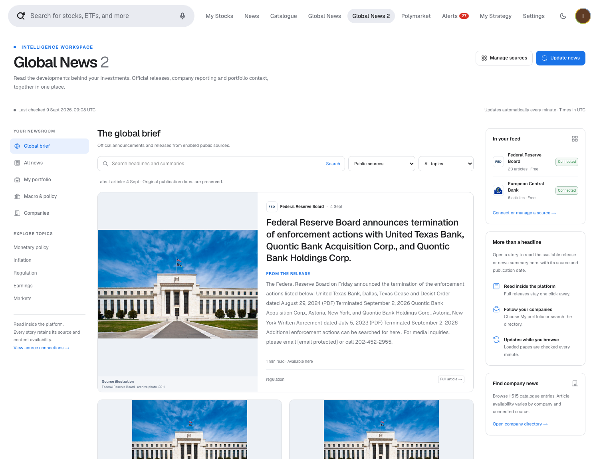
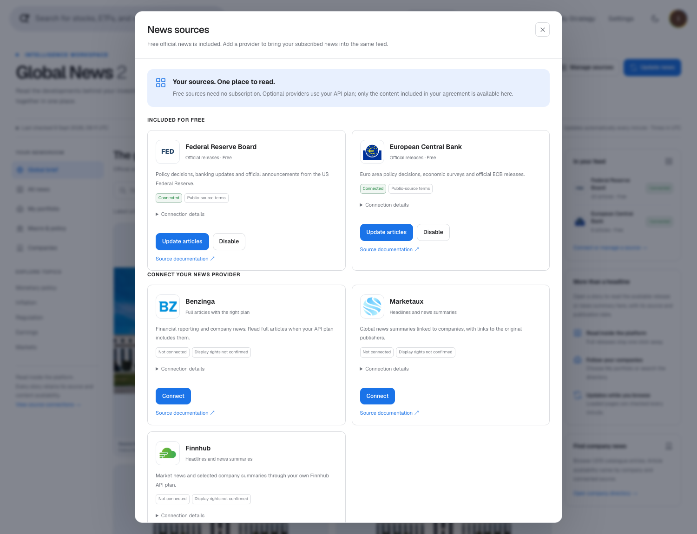
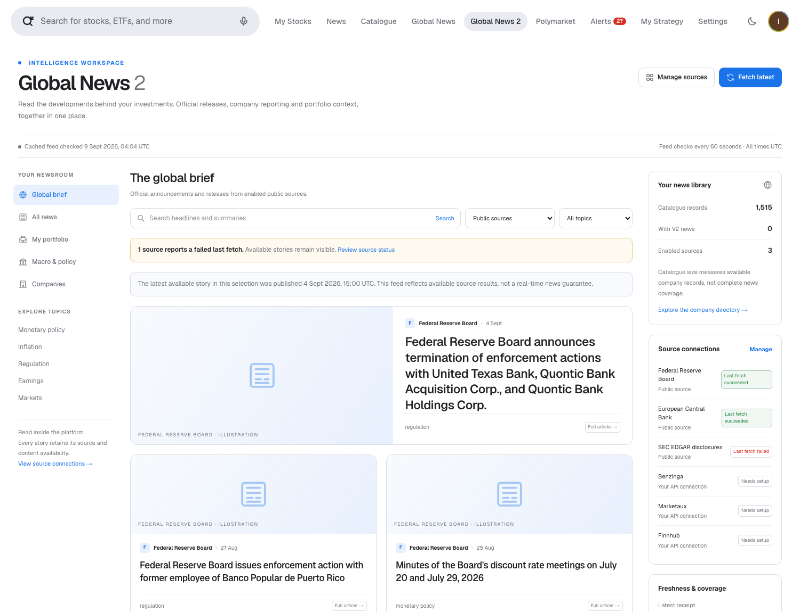
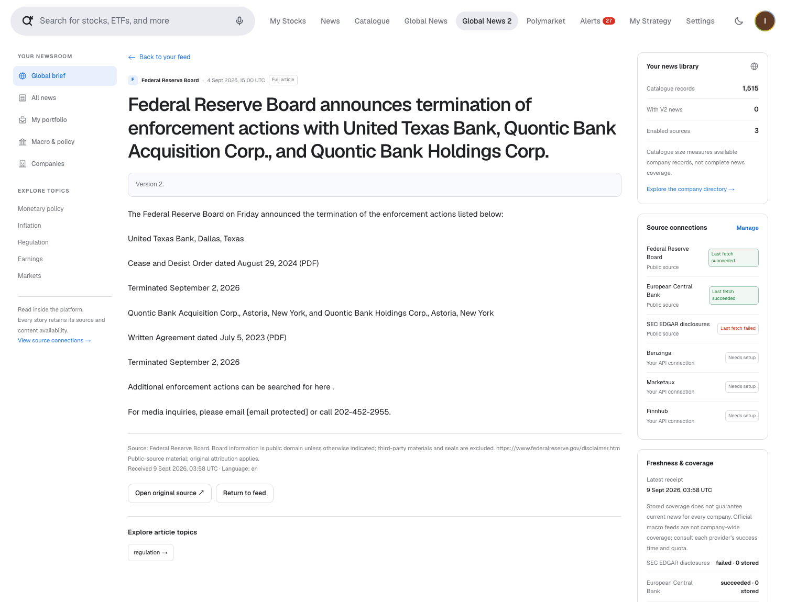
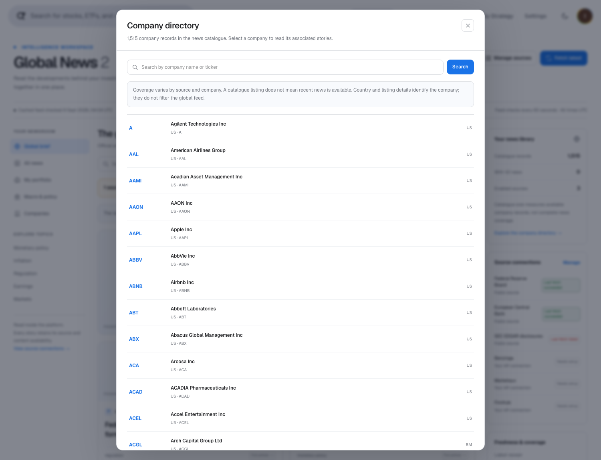
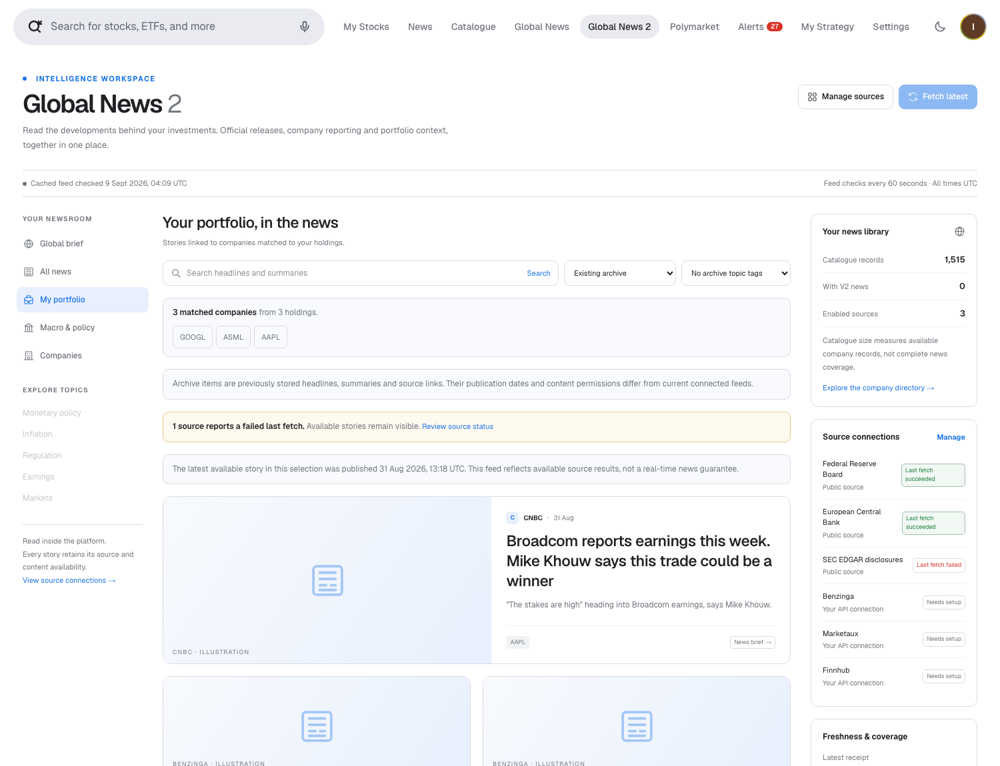
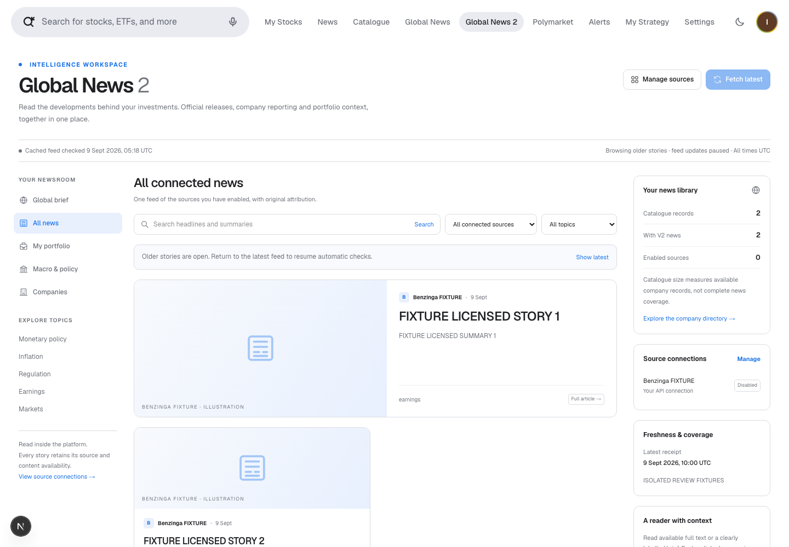

# News architecture V2: audit, implementation and growth plan

**Decision date: 9 September 2026. Scope: the existing MVP, its separate news service, 1,515 catalogue rows, and the path to 10,000–50,000 companies.**

> **Current working-tree status, 9 September 2026: 7 open findings — 2 P1 and 5 P2; R2 and R7 fixed and verified.** The original review identified nine findings. R2 passed four isolated browser acceptance cases; R7 passed the SEC failure/recovery fixture. This is a local evaluation build, not a release approval. Resolve the remaining P1 access-control and ingestion defects before connecting licensed feeds; resolve and retest the P2 regressions before release. The reviewed commits and original evidence remain recorded below; the later changes are uncommitted working-tree changes. See [review evidence and resolutions](news-v2-evidence/2026-09-09/review.json).

## Decision

Keep the saved V1 as a reference and evaluate **Global News 2** as the next news experience, subject to the open review findings. V1 demonstrates aggregation and company feeds, but its stored coverage, source classifications and polling behaviour do not establish dependable current coverage. V2 adds a free official-release feed, an internal article reader, explicit optional provider connections, company and portfolio filtering, and visible source health. Its implemented controls and coverage still have the defects detailed below.

Free users can read supported official releases without subscribing to a publisher. This does **not** provide every publisher’s full articles, comprehensive international company news, or guaranteed real-time coverage. A complete global commercial news product will need contracted coverage. Benzinga is the first full-text integration candidate; Marketaux is a candidate for global entity-tagged **snippets**. LSEG/Reuters and Factiva deserve enterprise evaluation when their coverage and display licences justify the cost. [1–11]

The working implementation is a **local single-workspace MVP**. Multi-tenant authentication, contractual entitlement enforcement, production retention rules and scale benchmarks remain release requirements. Adding 50,000 CSV rows alone would not meet those requirements.

## Saved version and rollback

Before changing the architecture, both repositories were committed and tagged `snapshot/news-v1-polymarket-20260909`:

| Repository | Baseline commit |
| --- | --- |
| MVP | `6e6c2730ca2923c2563be7bb7bb8054e1b457aeb` |
| Standalone news service | `c909cc2d716b44d1b75967f4f57554321849e428` |

The private local backup directory is `.local-backups/news-v1-polymarket-20260909/` in the MVP. It contains a full workspace archive, consistent SQLite and PostgreSQL backups, verified Git bundles, a checksum manifest and `RESTORE.md`. Source, existing reports, screenshots, the MVP and Polymarket integration are included. Private configuration is included in the protected backup; it must not be uploaded to the public repositories. Regenerable dependencies and build caches are excluded. V2 work is on `feature/news-v2` in both repositories.

## What the audit actually found

The MVP has **two news stores and two company universes**. `/news`, holdings and the original catalogue use SQLite and a 50-row CSV. `/global` uses the separate PostgreSQL service and the production CSV with 1,515 rows. Only 28 exact ticker strings overlap. The production file has 1,441 distinct exact company names; share classes and multiple listings must not automatically be treated as separate issuers. Another file contains 30,992 US instruments, including funds and other instruments; it is not evidence of 30,992 covered companies.

The live V1 database contained 38,244 articles and 52,423 company links. Of 1,515 active catalogue rows, 1,512 were resolved and 1,450 had some stored news. The latest ingestion run finished on **31 August 2026 at 17:31 UTC**, processed one company, and was roughly 202 hours old at the audit. Those numbers describe historical stored coverage, not a fresh complete feed.

| Finding | User impact | V2 response / remaining work |
| --- | --- | --- |
| Scheduler and runner acquired the same advisory lock on different connections | Scheduled ingestion could skip itself as “already running” | Remove the duplicate outer lock; keep exclusive execution in the runner |
| Non-ASCII characters were removed from the content hash | Different Cyrillic/CJK headlines could collapse into one | Preserve Unicode letters and digits; regression coverage |
| Timeout wrappers could leave network and limiter work running | Work continued after apparent failure; rate limits became misleading | Propagate cancellation; share redirect concurrency across companies |
| A paginated provider window could be marked complete after its first page | Missing stories became invisible to later incremental runs | Continuation and completion checks were added; R3, R8 and R9 show remaining oversized-cursor, changing-page-size and partial-failure defects |
| Provider names were used as a proxy for official-source quality | A syndicated report, issuer claim and official disclosure looked equivalent | Separate official, wire, aggregator and archive provenance; retain the original source |
| Any historical article could imply a successful connection | Old feeds looked healthy | Show per-provider last attempt, last success, errors and request budget |
| Existing company identity depended heavily on ticker strings | Cross-exchange collisions and false portfolio matches | Resolve using listing identity plus company evidence; show ambiguous/unmatched cases |
| Every headline opened a new tab | Users left the product immediately | Internal links were added; R5 shows that the shared preview guard breaks existing news readers in production |
| General-feed image enrichment crawled publisher pages on a read | Slow reads, extra network requests and uncertain image rights | Use supplied images only; independent provider failures and a five-minute general-feed cache |
| Consumer/API credentials and display permission were not modelled separately | Technical access could be mistaken for a licence | Explicit display/full-text settings; paid connectors disabled by default |

Some V1 defects are fixed to protect the comparison experience. V1 archive content retains its original, unverified permission status; moving it into a different UI does not grant new rights. The remaining production work includes authenticated access to all older routes, removal of the old Finnhub-key exposure endpoint, replacement of arbitrary-URL image enrichment still used by older paths, and tenant-aware storage. V2 does not use those mechanisms.

## Architecture and data flow

```text
Official feeds                 Optional entitled provider APIs
Fed / ECB / SEC                Benzinga / Marketaux / Finnhub
          \                    /
       Fixed-source fetch adapters
       URL allowlist · timeout · size cap · real HTTP budget
                       |
          Durable PostgreSQL jobs and leases
          incremental cursor · retry status · bounded batches
                       |
          Validate and normalise source records
          timestamps · rights · corrections / removals
                       |
       Articles + revisions + company evidence
       Company directory / listings → verified associations
                       |
       Authenticated V2 read API and provider settings
                       |
          Server-only MVP proxy on localhost
                       |
  Global News 2: all / macro / portfolio / company
  source selection · search · pagination · internal reader
```

Collection is source-driven: fetch a provider’s incremental stream once and associate each item with the relevant companies. Reading the directory or filtering a portfolio does not launch one external request per company. PostgreSQL stores jobs and checkpoints; a worker claims jobs with leases, refreshes leases and attempts to persist bounded batches and resume unfinished windows. R3 and R8 show that continuation is not yet reliable for every accepted response or page-size change. Source HTTP requests consume a shared database budget, including additional release-body and identity-mapping requests.

Each record includes the provider item ID, headline, supplied summary, permitted plain-text body, original URL, publisher, language, publication/update/receipt timestamps, topics, content mode, usage metadata, revision and deletion state. Company associations retain the evidence used to resolve them. Raw HTML is not rendered. Unknown image permission means no provider article photograph is imported. The updated interface uses separately credited institution photographs as source illustrations for Fed/ECB, and commercial connector logos for identification; those assets do not establish rights to upstream news photographs. Government seals are excluded.

Different providers’ copies remain attributable records. A future cross-provider story cluster should group related records without discarding independent reporting, corrections or conflicting claims. The MVP does not claim to have implemented semantic event clustering or an editorial fact-checking system.

## Sources, access and payment

| Source | What the connector supplies | Free / permission position | Current implementation |
| --- | --- | --- | --- |
| Federal Reserve Board | Institutional policy/regulatory releases and selected release text | No API key or publisher subscription. Board information is generally reusable unless marked otherwise; retain attribution and exclude third-party materials/seals. [1] | Live free source |
| European Central Bank | Selected institutional press releases and text | No subscription. Accurate attribution and modification disclosure apply; paid products must disclose the original is available free. Authored papers/speeches are excluded from this connector. [2] | Live free source |
| SEC EDGAR | Filing metadata, forms, dates, CIK-linked disclosures; supported document text where obtained | Public access without an API key; honest User-Agent and SEC fair-access rules. These are disclosures, not a complete journalism feed. [3–4] | Implemented; live requests returned HTTP 403 here |
| Benzinga | Incremental financial news, company tags, updates, removal events, optional full bodies | Provider API token and the appropriate business/customer-display agreement. Full text depends on the purchased product and entitlement. Project price is unknown. [5–6] | Connection UI and adapter; no paid credentials or live paid-feed test |
| Marketaux | Global headlines, descriptions/snippets, links, entity metadata | Free developer quota exists; published terms do not establish unrestricted business display. Obtain applicable commercial terms. **No full article bodies, including paid plans.** [7–9] | Connection UI and adapter; not connected |
| Finnhub | General headlines/summaries or a bounded selection of North American company-news queries | Personal plans cannot be used by a business even internally without written approval. Display/redistribution requires the appropriate rights. [10] | Connection UI and adapter; existing V1 key is not automatically reused |
| LSEG / Reuters | Enterprise global news and story APIs, identifiers and topics | Contracted product, source entitlements and customer-display/redistribution rights; a terminal login is insufficient | Enterprise evaluation only; no pretend connection [11] |
| Dow Jones / Factiva | Enterprise discovery, streams, archives and entitled article retrieval | Contracted source/content/display rights; consumer subscription is insufficient | Enterprise evaluation only [12] |

Marketaux’s advertised monthly API plans, checked on 9 September 2026: free **100 requests/day, 3 articles/request**; $29 **2,500/day, 20/request**; $49 **10,000/day, 50/request**; $99 **25,000/day, 100/request**; $199 **50,000/day, 100/request**. These prices describe API plans, not a confirmed customer redistribution licence. Its “200,000+ entities” claim is not a guarantee that our particular 50,000 companies have current news. [8]

The free official-source path has no publisher subscription charge. Hosting, engineering and maintenance still cost money. For paid content, an end user’s normal website login cannot be converted into API redistribution rights. The implemented forms accept provider API credentials, record the user’s declared display entitlement and separately enable full text where supported. A checked box does not verify a contract; it is a local setup control pending a production entitlement system.

## Reading inside the platform

The primary click opens an internal reader. Three honest content modes are available:

1. **Full article/release:** permitted text was actually retrieved and is rendered as plain text with attribution.
2. **News brief:** only the provider’s supplied summary is available; the UI says so.
3. **Source link:** legacy/archive records may have only a headline and source URL; such items are excluded from the current live V2 feed.

The 9 September working-tree update adds optional API fields `previewText` and `readingMinutes`. The preview is a literal excerpt of permitted, actually fetched text, up to 700 characters; it falls back to the original supplied summary when no permitted body is available. It is not an AI-generated summary, and the stored provider summary is unchanged. Reading time is estimated from the complete permitted body at 200 words per minute. The feed still omits full bodies; the internal reader retrieves them separately.

Live V2 articles must have a permitted nonempty body, or a summary of at least 80 characters with at least 40 alphanumeric characters beyond a repeated headline. This filter runs before cursor pagination. Unavailable/headline-only records remain stored for recovery; they are hidden rather than permanently deleted. The separately selected archive is unchanged. Unavailable official sources with no articles are hidden from default source filters and grouped under inactive settings; optional paid connectors remain discoverable.

This avoids silently dropping users into a new browser tab. Opening the original publisher is optional and explicit; that publisher may still require payment. No paywall bypass, subscriber-cookie forwarding, arbitrary publisher scraper, embedded browser login or iframe is used. ECB business links must open its own full page, so copying a permitted release into our reader is distinct from framing the ECB website. [2]

Existing `/news` All News/My Stocks, company detail news, `/global`, and global company feeds now point to internal reader links. These work in the configured local preview, but the shared reader guard returns HTTP 403 in production for all three legacy namespaces (R5). Production navigation therefore regresses until the guard is scoped appropriately or a working publisher fallback is restored. The original general-news brief cache is bounded to 2,000 items/30 days for this preview; that engineering limit is not itself a licence. Company catalogue pages also lead to the matching V2 company view, and the catalogue has an entry to the full 1,515-row news directory.

## Relevance, accuracy and freshness

**Official source** means identifiable institutional origin; it is not a guarantee that every claim is complete, impartial or correct. An issuer release is the issuer’s statement. A wire story is editorial reporting. An aggregator is a delivery mechanism. V2 preserves those distinctions instead of assigning universal credibility from a publisher-name regex.

Company-specific feeds require a verified association. Unmatched/ambiguous holdings are visible and are never silently expanded into the global feed. Direct company associations and general macro context remain distinct. A central-bank announcement can be useful to a portfolio without proving that it specifically concerns every holding. Provider entity tags remain evidence to check; they are not causal predictions about a share price.

Association repair is incomplete: adding a company or correcting its listing evidence does not relink unchanged articles on replay (R6). Independently, the already documented Finnhub targeted connector supplies only ticker query provenance; it still needs a verified symbol-to-listing mapping before its stories can populate company/portfolio filters. Neither limitation is resolved by the three successful sample-holding matches below.

The local portfolio resolver accepts up to 200 distinct holdings and reports an explicit limit for larger portfolios. This is separate from the paginated global company directory. Initial live matching identified only Apple. The final version resolves **all three current holdings** after adding two reviewed mappings: ASML/NASDAQ from ASML’s own share-listings page, and Alphabet Class A/GOOGL from its Q2 2026 filing. The mappings retain source URLs, review dates and a one-year review expiry; incorrect venues, countries and Class C substitutions remain rejected. V1 catalogue/listing rows were not changed. Unreviewed holdings are not quietly matched by ticker alone. [13–14]

V2 polls official sources every **15 minutes** by default. The original reviewed frontend read the first-page cache every **60 seconds**, then paused feed polling after pagination or opening an article; R2 reproduced retained/restored disabled-source cards. The working-tree frontend now revalidates all loaded pages every 60 seconds, rejects old pagination responses after source/access changes, and removes revoked-source cards after the 30-second status check observes revocation. Four isolated browser cases verified the R2 correction; polling and network delays still apply. Connected paid sources default to a five-minute collection interval, subject to their configured budget. This is **periodic refresh, not a real-time wire or guaranteed 60-second source latency**. Collection covers every eligible item in the bounded current official RSS snapshot, resumed across batches; it is not an exhaustive historical archive. Unchanged release bodies receive a daily correction rescan while they remain in RSS. A correction without a feed metadata change can therefore take about a day plus queue/budget delay to appear.

The working-tree official adapters preserve previously imported body text if retrieval fails, even when RSS metadata changed. Transient failures get up to three further attempts on subsequent feed checks, then return to the daily rescan cadence, subject to the existing request budget. A body-level HTTP 401/403 is recorded without automatic retries; retrying that body requires an explicit source-checkpoint reset. SEC transient document failures emit no article update, preserving existing text for the next bounded snapshot; SEC access-denial errors use the worker's paused-authentication handling. These changes do not bypass blocked sources.

The UI shows publication time separately from receipt/check time, partial errors, missing source coverage and exhausted quotas. A source checked today can legitimately have no release today. Successful polling does not prove that the upstream source published everything or that a company had no news.

Production targets should be agreed after measurement: 99% of eligible received items processed within two minutes, source-specific lag alerts after two missed collection intervals, correction/removal propagation within the contracted feed’s update interval, and separately sampled association precision. These are proposed acceptance targets, not measured MVP SLAs. A multilingual labelled evaluation set should include ambiguous tickers, subsidiaries, funds, share classes, renames, delistings and negative examples.

## Scaling from 1,515 to 50,000 companies

At one request per company and 55 requests/minute, a complete sweep takes approximately 27 minutes for 1,500 companies, 3 hours for 10,000 and 15 hours for 50,000—even before retries or pagination. Repeating a per-company query every five minutes would require 432,000, 2.88 million or 14.4 million requests/day respectively. Increasing thread count cannot overcome those quotas.

| Layer | Implemented now | Required before sustained 10k–50k operation |
| --- | --- | --- |
| Identity | Existing company/listing directory; conservative matching; visible unresolved cases | Audited issuer/security/listing hierarchy, permanent IDs such as LEI/FIGI/ISIN/CIK where licensed, aliases and corporate-action history |
| Acquisition | Bounded incremental provider jobs; shared source budgets | Contracted feed capacity, bulk initial backfill, source-specific completeness monitoring and recovery SLAs |
| Storage | Indexed PostgreSQL articles, associations, revisions and jobs | Retention/partitioning by measured volume; archival storage where licensed; backup restore drills |
| Search | Bounded text search and cursor pagination | Full-text/trigram or dedicated search index, language-aware ranking and relevance evaluation |
| Distribution | One local workspace; server-only credentials | Authenticated tenants and users, licence/user/source cache keys, per-request entitlement checks, audited revocation and deletion |
| Performance | Directory pagination avoids a 50k quote/news request fanout | Load tests at expected article count and concurrent users; query plans, queue lag, p95/p99 latency and failure budgets |
| Product | All/macro/portfolio/company views and source selection | Regional coverage policy, translations where licensed, editorial handling of disputed/corrected stories |

Do not replace the root 50-company CSV with the production file without adapting its schema and quote/profile loading. The two files have different fields, country formats, name conventions and exchange identifiers. The new news directory accesses the full service catalogue without launching quote requests for every row.

## Implemented interface and evidence

The separate `/global-v2` page includes the feed, full directory, portfolio/company views, topic/source filters, search, pagination, provider settings, request status and an internal reader. The subsequent interface update adds longer source-text previews, reading-time estimates, credited institutional source photographs, identifiable commercial connector logos and a simpler separation of active/inactive sources. Real-source screenshots and a machine-readable validation snapshot accompany this report under `screenshots/news-v2-*` and `news-v2-evidence/2026-09-09/`. The original screenshots below document the earlier interface; they are not evidence of the later working-tree styling. Test fixtures are not presented as live source evidence.

The final live check found **20 Fed releases, 6 ECB releases, zero SEC records**, and no connected commercial feed. All three sample holdings resolve, but **zero companies yet have newly ingested V2 company news**: the free records currently available are macro/regulatory releases, and SEC access is blocked. Matching a holding is not the same as supplying fresh company news. The separately selectable V1 archive supplies historical company briefs with unverified display rights and visible publication dates.

A subsequent read-only check of the working-tree reader found the same **26 visible releases, all 26 with permitted full text**. Fed bodies contain 284–3,364 characters; ECB bodies contain 1,827–11,172 characters; feed previews contain 282–700 characters. A bounded live inspection confirmed that the ECB survey release is already extracted in full. No headline-only stored items needed removal in this sample. Focused validation after the change passed **24 provider tests**, **7 PostgreSQL rollback tests**, TypeScript and whitespace checks. These checks cover the R7 correction, official retry/preservation policy and readable-feed pagination/preview rights; they do not close unrelated findings.

After restarting the local V2 service, bounded manual Fed and ECB syncs both succeeded at approximately **09:03 UTC on 9 September**, with the counts unchanged at 20 and 6. The full service suite subsequently passed **131 offline tests**; **19 Polymarket regression tests**, frontend TypeScript/ESLint and four isolated pagination/access browser cases also passed. The browser cases close R2 separately from the provider tests closing R7; seven other findings remain open.

### Updated interface: detailed cards and source photographs







*The photographs identify the publishing institution; they are not photographs of events described by current headlines. Fed credit: Federal Reserve Board, archive photograph (2011), from its [official photo/download page](https://www.flickr.com/photos/federalreserve/26088200676/sizes/l/). ECB credit: © European Central Bank / Bernd Hartung, archive photograph (2019); the [ECB press-photo conditions](https://www.ecb.europa.eu/press/contacts/html/press_photos.en.html) require credit and prohibit alteration/distortion. The whole image and proportions are preserved. Asset URLs, usage evidence and hashes are recorded in the MVP's `public/news-sources/README.md` and `manifest.json`. Provider identifiers imply no endorsement, partnership or purchased news entitlement. Additional mobile-settings and dark-mode captures are `news-v2-rich-providers-mobile.png` and `news-v2-rich-dark.png`.*

Pre-review validation completed: **127 offline news-service tests**, **6 PostgreSQL integration tests with transaction rollback**, **19 Polymarket regression tests**, **14 read-only local API checks**, production builds and targeted TypeScript/ESLint checks. Browser tests covered real release-body fidelity, internal/reloadable readers, provider forms, archive/company navigation, 390px mobile width and dark mode. Fixture-only tests additionally exercised revoked access, partial outage, credential handling and pagination. These checks did not cover the failing sequences found in the subsequent technical review; a passing build did not establish working production reader navigation. No paid provider credentials were available, so paid-feed ingestion and contractual entitlement have not been verified live.

### Earlier live interface examples, retained as historical evidence



*Captured from the running MVP on 9 September 2026. Publication dates, failed-source status and the distinction between catalogue size and news coverage are visible. Source illustrations are neutral interface artwork, not news photographs.*



*The 4 September Federal Reserve enforcement-release example contains 529 characters of retrieved release text. The reader preserves the source and original URL. It does not invent an article body from a headline.*


*Real connection settings: free sources plus optional API providers. No commercial key was saved or tested for this screenshot.*



*The news directory reads the 1,515-row service catalogue with pagination, separately from the original 50-company quote catalogue.*



*All three current holdings match. The view shows 18 real archived company stories; the newest was published on 31 August 2026. Archive status and the age warning remain visible. This is evidence of working company filters, not fresh free company coverage.*

## Independent technical review and required corrections

**Original review: 9 September 2026 — nine findings. Current status: seven open, R2 and R7 fixed in the working tree.** Three independent reviews covered the frontend, provider adapters, and worker/storage. The reviewed commits are MVP `f4d148137638c80a1888b77ede3d0d6e763f0d70` and news service `3005fa47056f581b23dbe2c902ae1572bc4f8ca9`. Provider reproductions used synthetic HTTP responses; browser tests intercepted API traffic; database fixtures rolled back all changes. These results establish defects in our implementation, not observed delivery failures by a live paid vendor. The original review made no application fixes or real provider configuration changes. The later verified R2 and R7 corrections are recorded separately, without changing the original observations or reviewed commit references. The [evidence register](news-v2-evidence/2026-09-09/review.json) contains both phases.

P1 means a defect to fix before connecting licensed feeds; P2 means a substantial correctness defect or regression to fix before releasing the affected scenario to customers. IDs match the Russian report. Code paths below are relative to `news-service`; the label `mvp/` denotes the separate MVP repository root, not a literal subdirectory. Line references identify the reviewed commits.

### R1 — P1: concurrent settings updates restore revoked access

**Trigger and observed result.** Two partial updates read the same configuration before acquiring the provider lock. One sets `enabled=false, displayLicensed=false`; the other changes only `fullTextEnabled=false`. The second write restores the earlier enabled/licensed values. A deterministic rollback fixture ended with `enabled=true, displayLicensed=true, fullTextEnabled=false`.

**Location:** `src/v2/store.ts:34–52`.

**Required correction and acceptance:** acquire the provider lock before reading, merging and validating configuration inside the transaction. Concurrent revocation and an unrelated settings change must retain the revoked state in either request order. **Status: open.**

### R2 — P1: pagination redisplays a disabled provider's stories

**Trigger and observed result.** Start loading older stories, disable the source, and receive a fresh empty feed; then deliver the old pagination response. The fixture restored two disabled-source cards after the UI had cleared them. A separate browser case loaded two pages and simulated disabling the source elsewhere: after six minutes the sidebar said Disabled, while both stories remained and the feed had stopped polling. The demonstrated exposure is headlines/summaries; this does not prove a full-text reader authorization bypass.

**Location:** `mvp/src/components/GlobalNewsV2.tsx:69`, `:125`, `:130`.

**Required correction and acceptance:** invalidate saved pages and outstanding responses when entitlement/source settings change, and maintain freshness checks for paginated views. Delayed responses and changes from another tab must not retain or restore disabled-source cards. **Status: fixed in the uncommitted working tree, browser-verified on 9 September 2026.**

**Resolution evidence:** the feed invalidates old request generations on access/settings changes, revalidates loaded pages every minute and filters cards against current provider access. Four fully intercepted browser fixtures passed: delayed pagination after disabling a source; revocation observed from another tab; correction/withdrawal on a loaded later page; and a later-page failure without preserving stale content. No JavaScript errors occurred and no real paid-provider settings changed. Results: [pagination-fix-validation.json](news-v2-evidence/2026-09-09/pagination-fix-validation.json). The original failing screenshots below remain historical review evidence.

### R3 — P1: accepted Finnhub responses exceed the worker's cursor limit

**Trigger and observed result.** The adapter accepts up to 1,000 articles but serializes remaining full records into its continuation. A synthetic response of 220 articles with 700-character summaries returned a 40-item batch and a 242,156-character checkpoint. Comparing that result with the actual worker validation shows it would be rejected before persistence: the limit is 100,000 characters, so replaying the same response cannot progress. This reproduction exercised the adapter and inspected the worker's rejection condition; it did not execute a complete worker job.

**Location:** `src/v2/providers/paid.ts:178–183`; `src/v2/worker.ts:88`.

**Required correction and acceptance:** use a bounded cursor with separate durable pending-item storage or an equivalent bounded continuation. The reproduced response must ingest completely in a finite number of jobs, including a restart between batches, without exceeding the worker limit. **Status: open.**

### R4 — P2: stale updates resurrect withdrawn articles

**Trigger and observed result.** Persist a source update at 10:05, then a removal without `updatedAt`, then replay an older update at 10:01. The removal sets stored `updated_at` to null, disabling the stale-update guard. The rollback fixture restored `deleted=false`, the old headline and the licensed body.

**Location:** `src/v2/store.ts:185–192`; removal shape in `src/v2/providers/paid.ts:114–117`.

**Required correction and acceptance:** preserve ordering metadata and tombstone precedence; define a source-confirmed restoration rule. The sequence above must keep the article withdrawn, including after restarting and replaying input. **Status: open.**

### R5 — P2: original news-reader links fail in production

**Trigger and observed result.** Existing News, company and Global News pages now link to the shared internal reader. It applies the local V2 guard to every namespace. Executing the actual route with production configuration returned HTTP 403 for `local`, `brief` and `service` before any database access. The service archive reader additionally depends on V2 configuration; the former publisher links did not.

**Location:** `mvp/src/app/api/reader/[namespace]/[id]/route.ts:7–8`; `mvp/src/lib/news-v2.ts:14–15`.

**Required correction and acceptance:** separate preview restrictions from supported reader behavior, or retain working publisher navigation when the reader is unavailable. Verify all legacy entry points after a production build and without V2 setup, under the intended access model. Removing access protection globally is not the proposed fix. **Status: open.**

### R6 — P2: catalogue repairs do not reconcile unchanged articles

**Trigger and observed result.** Ingest an unmatched article, add its exact matching company, and replay identical content. Resolution then succeeds independently, but the unchanged content hash bypasses association rebuilding: the fixture still had zero article-company links. The item remains missing from its company/portfolio view.

**Location:** `src/v2/store.ts:186`, bypassing `:195–198`.

**Required correction and acceptance:** reconcile entity associations independently of content revisions, or provide reconciliation when catalogue/mapping versions change. The test sequence must gain the correct association without editing the article or inventing a new text revision. **Status: open.**

### R7 — P2: temporary SEC retrieval failures erase stored text

**Trigger and observed result.** After an initial successful document retrieval, the same filing metadata is returned but its body request receives HTTP 503. The adapter emits the same source ID with `body=null` and a completed batch; the store overwrites the previously imported text. This was reproduced with synthetic responses, separately from the live SEC HTTP 403 limitation.

**Location:** `src/v2/providers/sec.ts:95–107`; replacement in `src/v2/store.ts:191`.

**Required correction and acceptance:** distinguish retrieval failure from an explicit withdrawal or rights change. Preserve previously permitted text through a temporary failure and retry retrieval; confirm both preservation on HTTP 503 and acceptance of a later genuine update.

**Resolution, 9 September 2026 — fixed in the uncommitted working tree.** `src/v2/providers/sec.ts` now skips the upsert on transient document failure instead of emitting a null-body revision. The next bounded SEC snapshot can retry normally; HTTP 401/403 propagates to the worker's paused-authentication handling. `test/v2-providers.test.ts` verifies success → document HTTP 503 → successful recovery: the failure emits no replacement item, and the same filing's body is available again on recovery. Existing text is therefore not overwritten by the failed attempt. All 24 provider tests and seven rollback database tests passed. This is fixture verification, not a successful live SEC connection; the observed HTTP 403 limitation remains.

### R8 — P2: Marketaux page-size changes skip articles

**Trigger and observed result.** The cursor saves the page number but not the effective plan-limited size. In a fixed 50-item fixture, page one returned IDs 1–3; a simulated same-key plan upgrade changed the size from 3 to 40, so page two returned IDs 41–50. The adapter reported completion with 37 items missing. This models a plan change during continuation; it is not a live vendor observation.

**Location:** `src/v2/providers/paid.ts:60–83`.

**Required correction and acceptance:** persist the effective page size or detect a change and safely replay the fixed window with deduplication. Page-size changes in either direction must retain all 50 fixture articles before advancing the stable watermark. **Status: open.**

### R9 — P2: later-page failures discard successful V1 Marketaux results

**Trigger and observed result.** The first page returns three valid articles, then page two returns HTTP 429. The adapter returns only `rate_limited`, losing all three articles already fetched. The new bounded pagination therefore regresses successful partial-result handling.

**Location:** `src/providers/marketaux.ts:178–203`, `:273–285`.

**Required correction and acceptance:** persist validated partial results, retain the incomplete-window status and previous stable watermark, and expose the failure reason. The reproduced sequence must save the three valid articles and allow a later run to complete without gaps or duplicates. **Status: open.**

### Synthetic review evidence



*R2, isolated fixture with all browser API requests intercepted. The cards are synthetic review stories, not real Benzinga articles or evidence of a connected paid account. The feed first cleared to zero cards; the old response restored two. The evidence register also records the separate six-minute pagination/status case.*

SEC reachability, unavailable paid credentials, the intentional local-only V2 scope and the absence of a 50,000-company load benchmark remain documented limitations, not additional findings in this count. The earlier passing tests do not close findings; R2 and R7 are closed only by the later code corrections and targeted browser/provider verification recorded above. Source reuse/payment conclusions are unchanged; no new commercial quote or live paid-feed verification is claimed.

## Operating the local version

Keep the existing V1 service on port 8080. Run the V2 service separately on localhost 8081 with `NEWS_V2_WORKER_ENABLED=true` and the V1 scheduler disabled. The root `.env` points `NEWS_V2_SERVICE_URL` to 8081. Both processes share the same `NEWS_V2_ADMIN_TOKEN`; the service additionally needs a random 32-byte base64 `NEWS_V2_ENCRYPTION_KEY`. Those values are server-only and have been configured in the local workspace without committing them.

The migration is additive. Paid providers are currently disabled and unconfigured; keep them that way until the P1 defects are fixed and the appropriate entitlement is confirmed. Default daily budgets are 600 actual HTTP requests per free source and 100 per paid source; these are conservative application caps, not purchased quota guarantees. Jobs and state survive restarts. Disabling a source is intended to stop display/fetch, but concurrent partial settings updates can restore enabled/licensed flags (R1), while the cached-page issue R2 has now been fixed and browser-verified. Withdrawal ordering also needs repair (R4). Credential and content cleanup must follow the exact provider agreement, including backup retention in a production system.

The V2 MVP proxy intentionally serves this single workspace only on localhost in development. Production requires authenticated tenant isolation before enabling it. No provider purchases, sales messages or public deployment were performed.

## Sources

All external sources were checked on 9 September 2026. Repository findings come from code inspection and the local databases; provider access and pricing claims below are based on the providers’ own documentation and terms.

1. [Federal Reserve disclaimer and reuse policy](https://www.federalreserve.gov/disclaimer.htm); [official RSS feeds](https://www.federalreserve.gov/feeds/feeds.htm).
2. [ECB disclaimer, copyright, reuse and framing conditions](https://www.ecb.europa.eu/services/using-our-site/disclaimer/html/index.en.html); [ECB RSS](https://www.ecb.europa.eu/rss/press.html).
3. [SEC EDGAR APIs and fair access](https://www.sec.gov/search-filings/edgar-application-programming-interfaces).
4. [SEC webmaster FAQ and public content](https://www.sec.gov/about/webmaster-frequently-asked-questions); [SEC RSS](https://www.sec.gov/about/rss-feeds).
5. [Benzinga API FAQ](https://docs.benzinga.com/introduction/faq); [newsfeed API guide](https://www.benzinga.com/apis/blog/mastering-the-benzinga-newsfeed-api/).
6. [Benzinga official AWS Marketplace product](https://aws.amazon.com/marketplace/pp/prodview-xwgvhwowjmw3g); [product EULA](https://d7umqicpi7263.cloudfront.net/eula/slK904JkkKlPCY4pY7CfGXLQMFrKBnDJAgNQKt_yXMI).
7. [Marketaux documentation](https://www.marketaux.com/documentation); [FAQ: snippets only](https://www.marketaux.com/faq).
8. [Marketaux pricing](https://www.marketaux.com/pricing).
9. [Marketaux terms](https://www.marketaux.com/tos).
10. [Finnhub terms: business use and redistribution](https://finnhub.io/terms-of-service); [API documentation](https://finnhub.io/docs/api).
11. [LSEG News overview](https://developers.lseg.com/en/product/news/overview); [official news API pagination guidance](https://developers.lseg.com/en/article-catalog/article/lseg-data-library-for-python--news-pagination).
12. [Dow Jones official Factiva Analytics SDK](https://github.com/dowjones/factiva-analytics-python).
13. [ASML issuer share-listings table: NASDAQ ASML](https://www.asml.com/en/investors/shares).
14. [Alphabet Q2 2026 filing cover: GOOGL Class A and GOOG Class C](https://www.sec.gov/Archives/edgar/data/1652044/000165204426000071/R1.htm).
