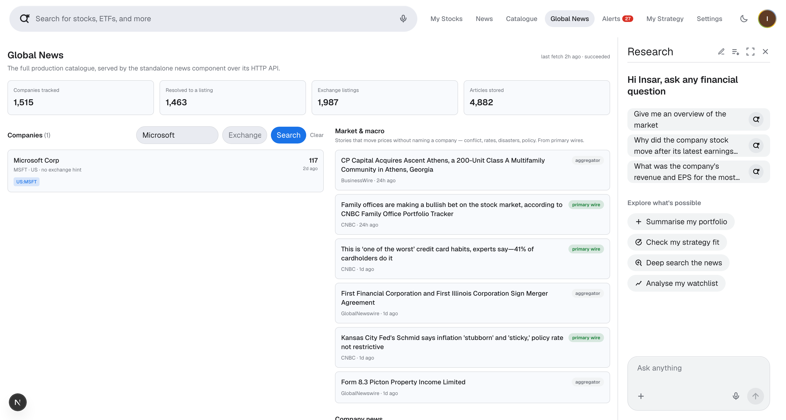

# Company news component — project report

A standalone backend that keeps a news feed for every company in a
**1,515-company catalogue**. Its own process, its own database, no UI.

Every figure comes from one run and is reproducible with `npm run metrics`
(coverage gaps: `npm run export:gaps`). Article counts are a point-in-time
snapshot of a live corpus — triggering a fetch moves them.

## Results

| | | | |
| --- | ---: | --- | ---: |
| Companies in catalogue | **1,515** | Companies returning news | **1,007 (66.5%)** |
| Resolved to a real security | **1,465 (96.7%)** | Attribution certain | **99.8%** of links |
| Exchange listings found | **1,990** | Articles carrying an image | **81.3%** |
| Depositary receipts found | **140** | Refusals / failures | **0 / 0** |

**Recurring cost: $0.** No paid API, and no language model is called anywhere.

**What each row means**

- **Resolved to a real security** — for 96.7% of tickers we worked out exactly
  which real, tradeable share it refers to.
- **Attribution certain** — 99.8% of stored articles came from a provider that
  *knew the ticker*. Only 0.2% rest on matching a company name.
- **Exchange listings** — those 1,465 companies trade in 1,990 places in total;
  many trade on more than one exchange.
- **Depositary receipts** — 140 of those listings are a foreign share wrapped
  for trading elsewhere: 139 American (ADR) and 1 global (GDR).
- **Refusals / failures** — no provider refused us, and nothing crashed.

## The idea that makes it work

**The problem:** free news APIs only cover companies listed in America. A third
of this list isn't American.

**The trick:** most foreign companies *also* trade in America under a different
code. Toyota is `7203` in Tokyo, but also `TM` in New York. That American
version is a **depositary receipt** — the same company, wrapped so Americans
can buy it.

So before fetching any news, we find every place each company trades. If any of
them is American, a free US news API can cover it.

| Segment | Companies | What it means |
| --- | ---: | --- |
| US exchange listing | 1,253 | Trades on NYSE or Nasdaq — well covered |
| US OTC line only | 183 | An American presence, but on the quieter over-the-counter market, where coverage is thinner |
| **Reachable with a US symbol** | **1,436 (94.8%)** | The two above: we have *some* American code to ask about |
| No US line at all | 29 | Trades only abroad — must fall back to name search |
| Unresolved | 50 | Ticker matched no identifier in our sources |

**94.8% is the whole argument.** Because the listing work was done first, almost
everything became reachable with free tools. Without it, we would have had to
buy a global news service.

## A ticker is not an identifier

A ticker is just a short code **on one particular exchange**. The same code
means different companies on different exchanges:

- `BBY` in **London** = Balfour Beatty, a construction firm
- `BBY` in **New York** = Best Buy, an electronics retailer

Ask for "news for BBY" and you get **Best Buy's news filed under Balfour
Beatty**. The feed looks completely normal — full of real articles — and is
about the wrong company entirely. That is what makes it dangerous: nothing
looks broken.

**We found seven of these:**

| | | | |
| --- | --- | --- | --- |
| `BBY` Balfour Beatty → **Best Buy** | `ADM` Admiral → **Archer-Daniels** | `NOV` Novo Nordisk → **NOV Inc** | `ENR` Siemens Energy → **Energizer** |
| `FTK` flatexDEGIRO → **Flotek** | `CWK` Cranswick → **Cushman** | `MOVE` Medacta → **Corvex** | |

**Filtering by exchange does not fix it.** The obvious fix is to ask for "BBY,
*in London*". That fails too, because Archer-Daniels-Midland (`ADM` in New
York) **also trades in London** — so "ADM in London" still returns the wrong
company.

**The only reliable check is the name.** We ask the provider what company it
thinks the ticker is, then compare that to the name in our list. If they
disagree, we reject it.

All seven now resolve correctly — and each **gained a US symbol in the
process**. While correctly identifying Balfour Beatty we also found its American
code, `BAFBF`, so its news can now come from a free US provider.

## Wrong articles are thrown away, not hidden

For companies we can look up **by ticker**, the provider tells us exactly which
company a story is about — no guessing. But for companies with no US listing
there is no ticker to ask with, so we fall back to **searching by company
name** — and a name search cannot tell a company called Jensen from a person
called Jensen.

**Jensen-Group** is a Belgian maker of industrial laundry machines; its name
shortens to "Jensen". **Jensen Huang** is the CEO of Nvidia, one of the most
written-about people in business. Searching for "Jensen" returned hundreds of
Nvidia stories, filed under a small Belgian laundry-equipment maker.

Same pattern with **Kid ASA**, a Norwegian home-textiles retailer. Its name
shortens to "Kid"; searching returned a review of a film called *Club Kid*.

**What we do about it.** Before saving any article found by name search, we
check it is genuinely about that company:

1. **Reduce the name to its distinctive words** — `Jensen-Group` → `jensen`.
2. **Multi-word names need two words present.** "Munich Reinsurance lifts
   profit guidance" keeps; "Munich hosts Oktoberfest" is rejected.
3. **Single-word names need the word *and* business vocabulary** — shares,
   earnings, revenue, results, acquisition, dividend. "Jensen Huang could
   redefine NVIDIA" is rejected; "Jensen Group reports record revenue" keeps.

Articles that fail are **never stored** — not saved and quietly marked
"low quality". **3,041 were thrown away in the last run.** A wrong article never
reaches the feed at all.

## Which companies have no news, and why

The full list is exported as data — **[`data/coverage-gaps.csv`](../data/coverage-gaps.csv)**,
one row per company with a `gap_reason`, regenerated with `npm run export:gaps`.
**508 of 1,515** produced no news. They are not one problem:

| Gap reason | Companies | Whose problem is it? |
| --- | ---: | --- |
| `no_news_us_exchange` | 276 | **Nobody's.** Identified correctly, asked correctly, genuinely quiet that week |
| `no_news_otc_only` | 154 | Thin OTC coverage — a paid provider would help |
| `no_news_no_us_line` | 29 | Trades only abroad; no free US-centric source reaches it |
| `unresolved_frankfurt_line` | 18 | Ours — `.F` Frankfurt lines are not in our identifier sources |
| `unresolved_london_secondary_line` | 16 | Ours — same, for `0XXX` LSE codes |
| `unresolved_absent_from_directory` | 8 | Absent from Finnhub's US directory |
| `unresolved_depositary_line` | 5 | `.Y` / `_Y` lines matching no identifier |
| `unresolved_name_check_rejected` | 1 | The safety check correctly refusing a ticker collision |
| `duplicate_listing_line` | 1 | **Nothing is missing** — same company already covered, *with news*, under another ticker |

**"Unresolved" means one specific thing:** the ticker could not be matched to an
identifier in the sources we use. It does **not** mean the company is delisted.
Checking them individually, most are actively traded:

- **16 are London `0XXX` lines** — `0FIN` Orkla, `0IU8` Safran, `0NQM` Vinci,
  `0R22` Barrick Gold. Large, actively traded companies. The `0XXX` code is an
  LSE convention our identifier sources do not index.
- **17 are Frankfurt `.F` lines** — `EADS.F` Airbus, `MAKS.F` Marks & Spencer,
  `CMXH.F` CSL. Same story.
- **1 is a duplicate that costs nothing** — `NEMC.L` Newmont is already covered
  as `0R28`, which holds 12 articles. `gap_reason` counts a row as a duplicate
  only when its twin actually *has news*; six other same-name pairs exist, but
  both sides are empty, so those are counted as real gaps rather than written
  off.
- **11 are plain US tickers absent from Finnhub's 30,995-symbol US directory** —
  `EA`, `SKX`, `EQR`, `JHG`. Some are genuine take-privates; others look like
  directory gaps. We do not claim to know which without checking each.

**The name check now resolves trading names and native-language names.** A
surface-form comparison cannot know that "Westinghouse Air Brake Technologies"
and "WABTEC CORP" are one company, or that "MUENCHENER RUECKVER AG-REG" is
Munich Re in German — both were correct identifiers rejected for looking
different. A small, explicit alias table handles them, and both now resolve.

The one remaining rejection is **correct and deliberate**: `P` matches
"EVERPURE INC-A" in the US directory, while the catalogue row is Pure Storage.
Those are different companies, and refusing the match is the same protection
that caught the seven ticker collisions above.

**The catalogue also double-counts.** 1,515 rows are not 1,515 distinct
businesses: Novartis appears three times (`NOVN`, `NOVNEE`, `0QLR`), SAP three
times (`SAP`, `0NW4`, `SAPG.F`), Alphabet twice (`GOOGL`, `0HD6`). Coverage
percentages are therefore computed per *row*, and the true per-business figure
is somewhat better than the headline suggests.

### The 50 unresolved companies

Every one listed, with why it did not resolve. Grouping comes from `gap_reason`
in [`data/coverage-gaps.csv`](../data/coverage-gaps.csv) (`npm run export:gaps`),
so this table and that file cannot drift apart.

**"Unresolved" means the ticker matched no identifier in our sources — not that
the company is delisted.** Each note states only what the data shows: the
supplier's exchange hint, the resolver's own reason, and whether the same
company resolves under a different ticker. Where a company's real-world status
is unknown to us, the note reports what was observed rather than guessing.

**Frankfurt secondary lines — 18**

| Ticker | Company | Why it did not resolve |
| --- | --- | --- |
| `AFRA.F` | Air France-KLM SA | Same company resolves as `AFRA_F`, but that row is also quiet |
| `BMRM.F` | Société Anonyme des Bains de M | OTC pink-sheet line; not carried in the US exchange directory |
| `BWEF.F` | BW Energy Limited | OTC pink-sheet line; not carried in the US exchange directory |
| `CIEZ.F` | Corporación Interamericana de  | OTC pink-sheet line; not carried in the US exchange directory |
| `CMXH.F` | CSL Limited | OTC pink-sheet line; not carried in the US exchange directory |
| `CRRS.F` | Cirrus Aircraft Limited | OTC pink-sheet line; not carried in the US exchange directory |
| `EADS.F` | Airbus Group SE | Same company resolves as `0KVV`, but that row is also quiet |
| `EDVM.F` | Endeavour Mining Corp | Same company resolves as `EDV`, but that row is also quiet |
| `ELFI.F` | E-L Financial Corporation Ltd | OTC pink-sheet line; not carried in the US exchange directory |
| `FSPK.F` | Fisher & Paykel Healthcare Cor | OTC pink-sheet line; not carried in the US exchange directory |
| `FTRO.F` | First Resources Limited | OTC pink-sheet line; not carried in the US exchange directory |
| `LBGU.F` | L E Lundbergföretagen AB (publ | OTC pink-sheet line; not carried in the US exchange directory |
| `LVMH_F` | LVMH Moët Hennessy - Louis Vui | No exchange hint supplied, and the symbol matched no identifier |
| `MAKS.F` | Marks and Spencer Group PLC | OTC pink-sheet line; not carried in the US exchange directory |
| `NVPT.F` | Navitas Petroleum, Limited Par | OTC pink-sheet line; not carried in the US exchange directory |
| `NVZM.F` | Novozymes AS | OTC pink-sheet line; not carried in the US exchange directory |
| `PBTD.F` | Plover Bay Technologies Limite | OTC pink-sheet line; not carried in the US exchange directory |
| `QBEI.F` | QBE Insurance Group Limited | Same company resolves as `QBEI_F`, but that row is also quiet |

**London secondary lines — 16**

| Ticker | Company | Why it did not resolve |
| --- | --- | --- |
| `0FIN` | Orkla L | London line; the LSE code is not in OpenFIGI or the US directory |
| `0FQI` | Publicis Groupe L | London line; the LSE code is not in OpenFIGI or the US directory |
| `0HAC` | ACS Actividades Constr y Srvcs | London line; the LSE code is not in OpenFIGI or the US directory |
| `0IU8` | Safran L | London line; the LSE code is not in OpenFIGI or the US directory |
| `0MEC` | Nordex L | London line; the LSE code is not in OpenFIGI or the US directory |
| `0MET` | Konecranes Abp | London line; the LSE code is not in OpenFIGI or the US directory |
| `0N6B` | Arcadis L | London line; the LSE code is not in OpenFIGI or the US directory |
| `0NQC` | Pandora L | London line; the LSE code is not in OpenFIGI or the US directory |
| `0NQM` | Vinci L | London line; the LSE code is not in OpenFIGI or the US directory |
| `0NUX` | Prysmian L | London line; the LSE code is not in OpenFIGI or the US directory |
| `0NZT` | UCB L | London line; the LSE code is not in OpenFIGI or the US directory |
| `0Q6M` | Unipol Gruppo Finanziario SpA | London line; the LSE code is not in OpenFIGI or the US directory |
| `0QEP` | Maire Tecnimont SpA | London line; the LSE code is not in OpenFIGI or the US directory |
| `0R22` | Barrick Gold Corp | London line; the LSE code is not in OpenFIGI or the US directory |
| `0RGT` | William Demant Holding AS | London line; the LSE code is not in OpenFIGI or the US directory |
| `0RKF` | Construcciones y Auxiliar de F | London line; the LSE code is not in OpenFIGI or the US directory |

**Absent from the US directory — 8**

| Ticker | Company | Why it did not resolve |
| --- | --- | --- |
| `ADBE` | Adobe Systems Inc | Matched only a derivative contract (`ADBE L 07/27/20 1`), not an equity line |
| `AVB` | AvalonBay Communities Inc | Matched an identifier with no exchange attached, so no venue could be confirmed |
| `CPRX` | Catalyst Pharmaceuticals Inc | Hint says NASDAQCM, but the symbol is absent from the 30,995-row US directory |
| `EA` | Electronic Arts Inc | Hint says NASDAQGS, but the symbol is absent from the 30,995-row US directory |
| `EQR` | Equity Residential | Hint says NYSE, but the symbol is absent from the 30,995-row US directory |
| `JHG` | Janus Henderson Group PLC | Hint says NYSE, but the symbol is absent from the 30,995-row US directory |
| `ORLA` | Orla Mining Ltd | Matched an identifier with no exchange attached, so no venue could be confirmed |
| `SKX` | Skechers USA Inc | Hint says NYSE, but the symbol is absent from the 30,995-row US directory |

**Depositary-receipt lines — 5**

| Ticker | Company | Why it did not resolve |
| --- | --- | --- |
| `LVMU.Y` | LVMH Moet Hennessy Louis Vuitt | OTC pink-sheet line; not carried in the US exchange directory |
| `LVMU_Y` | LVMH Moet Hennessy Louis Vuitt | No exchange hint supplied, and the symbol matched no identifier |
| `RYAA.Y` | Ryanair Holdings PLC ADR | Same company resolves as `0RYA`, but that row is also quiet |
| `RYAA_Y` | Ryanair Holdings PLC ADR | Same company resolves as `0RYA`, but that row is also quiet |
| `SMSG.Y` | Samsonite International SA ADR | OTC pink-sheet line; not carried in the US exchange directory |

**Covered under another ticker — 1**

| Ticker | Company | Why it did not resolve |
| --- | --- | --- |
| `NEMC.L` | Newmont Corporation | Same company resolves as `0R28`, which has news — nothing missing |

**Refused by the name check — 1**

| Ticker | Company | Why it did not resolve |
| --- | --- | --- |
| `P` | Pure Storage Inc | Directory row is **EVERPURE INC-A** — refused, correctly |

**Unresolved but still served — 1**

| Ticker | Company | Why it did not resolve |
| --- | --- | --- |
| `GOLD` | Goldcom Inc | Directory row is **GOLD.COM INC** — refused, correctly; found by name search, so not a coverage gap |

### What is actually fixable

| Fix | Companies | Status |
| --- | ---: | --- |
| Alias table for trading names and non-English names | 2 | **Done** — `WAB`, `MUV2` now resolve |
| Accept `_` as a venue separator alongside `.` | 3 | **Done** — applied at lookup |
| Map `0XXX` / `.F` codes via an LSE/Deutsche Börse identifier source | 33 | Needs a second identifier source |
| Paid provider for OTC and non-US lines | up to 183 | Cost, not code |

The first two are done and reflected in the figures above. The remaining two are
not code problems: one needs an identifier source that indexes European
secondary lines, the other needs a licence.

## Every link now points at the publisher

Two separate faults made stored links fail when clicked. Both are fixed.

**1. Google News redirects (~1,400 articles).** These arrived as
`news.google.com` links rather than publisher addresses, and cannot be
repaired: the token decodes to an opaque Google identifier rather than the
article's address, the page returns nothing to a non-browser client, and
browsers frequently refuse the redirect. Such a story can never show a picture
either. We stopped storing them.

**2. Finnhub redirect wrappers (4,975 articles — 98% of the feed).** Finnhub
does not return the article's URL. It returns a link into *its own* domain,
`finnhub.io/api/news?id=…`, which 302s onward to the publisher. Storing the
wrapper rather than resolving it costs three things:

- every reader paid an extra hop, and the link dies entirely if Finnhub is down
   — a news archive should not depend on the liveness of the API it came from;
- the wrapper **hid the destination**, so a dead publisher could not be
   filtered: the URL looked healthy right up until the click;
- **dedupe degraded**, because every wrapper carries a distinct `id`, so one
   wire story syndicated to three outlets was three separate articles.

Ingest now resolves the wrapper to the publisher's own address before storing,
and a backfill rewrote all 4,975 existing rows. **0 wrappers remain**, across
**77 distinct publisher domains**.

**What the wrapper was hiding: `chartmill.com`.** With destinations visible, one
host turned out to be dead — it refuses the connection outright, returning no
HTTP status at all in ~0.35s, with a browser user-agent, which a reader sees as
a 504. It accounted for 189 articles and 188 broken images. It is now filtered,
via a configurable `DEAD_ARTICLE_HOSTS` list.

That list is deliberately tiny and evidence-based. It is **not** a list of sites
that block automated clients: Benzinga and Seeking Alpha both refuse our
requests while serving browsers perfectly well, and dropping them would discard
2,298 working articles. A host qualifies only when it fails for a real browser
too.

| | Before | After |
| --- | ---: | ---: |
| Links via a redirect wrapper | 4,975 (98%) | **0** |
| Links on dead hosts | 189 | **0** |
| Broken Google links | ~1,400 | **0** |
| Articles carrying an image | 65% | **81.3%** |
| Companies returning news | 1,163 | 1,007 |

The lost coverage is real, and it is the clearest argument for a paid provider:
one returns genuine publisher links and images for exactly these companies.

## What happens when a reader clicks

Links now go straight to the publisher. That fixed the broken ones — but it
exposes a second problem that is worth stating plainly, because it is the
clearest argument for buying content.

**Every headline leaves our platform**, and where it lands is the publisher's
site, not ours:

| Publisher | Share of articles | What the reader sees |
| --- | ---: | --- |
| **benzinga.com** | **33.4%** | Often a bot check or a sign-up prompt |
| finance.yahoo.com | 30.8% | Opens normally |
| **seekingalpha.com** | **15.8%** | Often a registration wall |
| fool.com, cnbc.com, and 72 others | ~20% | Mostly opens normally |

**So roughly half of all clicks (49%) land on a site that may ask the reader to
register before showing the article.** Nothing is broken — these are the correct
publisher URLs, correctly resolved. The reader simply meets someone else's
paywall on a link we presented as ours, and a different site layout each time.

**We did not remove them.** Benzinga and Seeking Alpha serve real browsers
perfectly well; they only refuse automated clients, so we cannot reliably detect
a wall in advance. Dropping both would delete **49% of the catalogue's articles**
to avoid an inconvenience that many readers never hit.

**This is not fixable with the current providers.** Finnhub and Marketaux
license a headline, a teaser and a **link** — their terms require the link out.
Rendering the full text anyway, or scraping the publisher's page for it, is
republishing copyrighted work. The fix is to license content we are permitted to
display, which is what the recommendation below is about.

## The component in use

The service has no UI of its own — it is a backend. These are from the existing
research app consuming it over its HTTP API, which is how it would be integrated.

*Every company in the catalogue, with the venues it resolved to. `LN:0A1U` is
the London line, `US:UBER` the US symbol news is actually fetched with. A `0`
with "no news" is a clean zero, not an error — the distinction the run reporting
is built around.*

*Search by name or ticker. The result shows the resolved listing (`US:MSFT`) and
the stored article count.*

*One company's feed. "also mentions 1 other" is the shared-article model: a story
naming several companies is stored once and linked to each, never duplicated per
company.*

**Round-ups are filtered out of a company's feed.** Aggregators tag a single
macro or sector article against every ticker it mentions — "10 IT stocks with
whale alerts" arrives filed against ten companies at once. Attribution is
*certain* (the provider named the ticker) but the story is not *about* any one
of them, and left unfiltered those dominate the feed of a widely-mentioned
company like Microsoft.

A company's own feed therefore defaults to `max_companies=3`: an article filed
against more than three companies is a list, not company news. The relevance
score also carries a round-up penalty applied at read time, where the live
company count is known. Callers that want the unfiltered set pass
`max_companies` explicitly.

## The two timing numbers

They measure different things.

**A 26-minute run** — fetching news for every company, day to day. Finnhub's
free plan allows 60 requests per minute, and we ask about one company per
request. 1,434 companies ÷ 55 per minute ≈ 26 minutes. **The code is not slow —
it is deliberately waiting** to stay inside the free limit. A paid tier would
cut this to a few minutes and change nothing else.

**A ~9-minute first start** — this happens **once**. On first boot we look up
all 1,515 tickers to find their exchanges, via OpenFIGI. Without a key that
allows 25 lookups a minute; with a **free** key, 250 a minute and larger
batches — hence 9 minutes rather than 38. After the first time it never happens
again.

## Design decisions worth knowing

- **Provider-agnostic.** Sources sit behind one interface, ordered by config.
  Adding one is a config change, not a rewrite.
- **Idempotent.** Articles are keyed on a cleaned-up URL, so a daily re-run
  stores nothing new. Verified: zero duplicate URLs.
- **"No news" is not "provider refused."** They look identical if you only
  count articles. The first is normal; the second means coverage is dying. They
  are recorded separately, along with every provider tried per company —
  because a working fallback can hide a broken primary.
- **No language model.** Article text is written by strangers; letting a model
  read it and decide what gets stored would hand outsiders influence over the
  pipeline. The rules used instead are unit-tested against real failures.

## Do we need to pay? — and what to buy

**Not for coverage.** 94.8% is already reachable free and ticker-native.

**Yes, for the reading experience.** Three problems are not solvable with any
free tier, and they are the ones a user actually feels:

1. **Every headline leaves our platform.** The reader lands on Yahoo, Benzinga,
   Seeking Alpha or Fool — a different site, a different layout, each time.
2. **Some of those sites demand a sign-up or a subscription** before showing the
   article. We cannot tell in advance which, so the reader plays paywall
   roulette on links we presented as ours.
3. **We cannot legally fix that ourselves.** Free and low-cost APIs — Finnhub,
   Marketaux, Alpha Vantage — license a **headline, a short teaser and a link**.
   Their terms require the link out. Displaying the full text we did not license,
   or scraping the publisher's page for it, is republishing someone else's
   copyrighted work. Financial publishers enforce this actively, and it is not a
   risk worth taking to save a click.

**So the requirement "show the article in our own UI" is a licensing decision,
not an engineering one.** The fix is to buy content we are permitted to display.

### Recommendation: Benzinga's licensed newsfeed as primary

Benzinga owns its newsroom, so it can license what an aggregator cannot. Its
paid tiers are **explicitly embeddable** — the full body and the image may be
published inside our own interface, with no redirect and no third-party
sign-in. Its free tier is headline + teaser + link, which is exactly the
constraint we are trying to escape.

| Requirement | How Benzinga meets it |
| --- | --- |
| Show the article without redirecting | Paid tiers license the **full body and image** for display on our platform |
| Always fresh, automatically | Pull REST with `updatedSince`, plus **WebSocket, TCP stream and webhooks** — push, not polling |
| No per-company rate ceiling | A firehose of the newsroom, not one request per company — the cost stops scaling with catalogue size |
| One consistent source | One publisher, one voice, one layout — no paywall roulette |

That last row also solves the scale problem in the section above: polling costs
one request per company per day, so 50,000 companies is 50,000 requests. A
stream costs the same regardless of how many companies we track.

**The honest limitation.** Benzinga publishes roughly 130–160 full articles a
day from a US-focused newsroom. That is deep, not wide — it will not cover
Chinese A-shares or thin European lines. It replaces the *quality* of our feed,
not all of its *breadth*.

### The two-provider architecture

Exactly two, which is the practical minimum that still covers the catalogue:

| Tier | Provider | Licence | Reader experience |
| --- | --- | --- | --- |
| **Primary** | **Benzinga (paid)** | Full body embeddable | Reads in our UI. No redirect, no sign-in |
| **Fallback** | **Marketaux** | Headline + link | Opens the publisher — only for companies Benzinga does not cover |

Everything needed to make this switch already exists: providers sit behind one
adapter interface and are ordered by `NEWS_PROVIDER_ORDER`, so adding Benzinga
is a new adapter plus a config change, and Finnhub can be dropped the day the
licensed feed proves out. The article schema already carries `image_url` and a
summary; a licensed body needs one nullable `body` column and a UI that renders
it instead of linking out.

**Pricing is not published** — content licensing is quoted per customer, via
`licensing@benzinga.com`. The brief offers to provision a paid key, so the ask
is a quote for the embeddable-body tier at ~1,500 companies, with room to grow.

## Known limits

- **50 companies (3.3%) unresolved** — see the table above; most are foreign
  secondary listings our identifier sources do not index, not delistings.
- **Name matching is the weakest component.** Some pairs are undecidable from
  names alone: "Adobe Systems" vs "Adobe" is indistinguishable from
  "Prudential" vs "Prudential Financial" — the first is one company, the second
  is two. Those route to a flagged, reduced-confidence path rather than a guess.
- **Some publishers block us.** Bloomberg returns an error to automated
  requests, so those stories carry no image. We do not disguise the service as
  a browser to get around it.
- **One ingest worker**; parallel workers need shared rate limiting.

Full detail: [README.md](../README.md) · [COMPARISON.md](COMPARISON.md) ·
[API.md](API.md) · [OPERATIONS.md](OPERATIONS.md) · `data/listings-mapping.csv`
