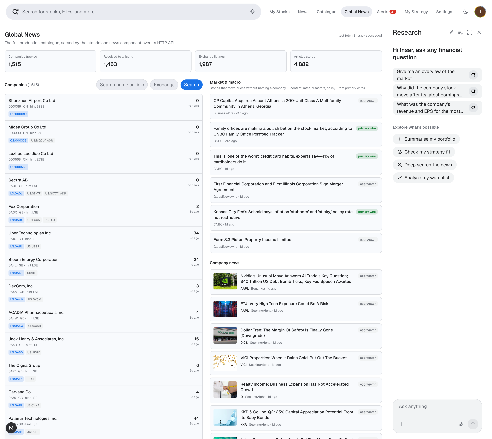
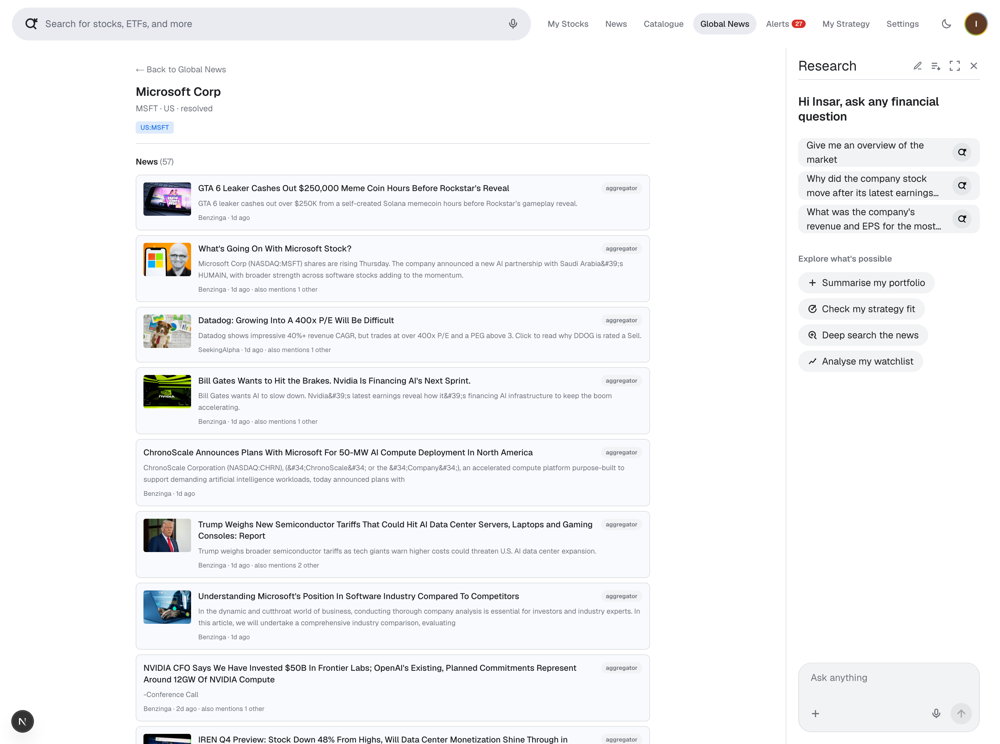

# Company news component — project report

A standalone backend that keeps a news feed for every company in a
**1,515-company catalogue**. Its own process, its own database, no UI.

Every figure is reproducible with `npm run metrics`; the gaps with
`npm run export:gaps`. Article counts are a snapshot of a live corpus.

## Results

| | | | |
| --- | ---: | --- | ---: |
| Companies in catalogue | **1,515** | **Connected** | **1,501 (99.1%)** |
| Identified to a real security | **1,510 (99.7%)** | Returning news | **1,449 (95.6%)** |
| Exchange listings found | **2,021** | Attribution certain | **99.9%** of links |
| Depositary receipts | **152** | Articles with an image | **83.6%** |

**Recurring cost: $0.** No paid API, and no language model is called anywhere.

**"Connected" is the metric that matters.** A company counts as working when it
either has news *or* was asked correctly and genuinely had none. A quiet week is
a real answer — treating it as a failure is how a broken pipeline hides.
`GET /v1/status` reports this live and names the companies in each faulty state.

## How it works

**The problem:** free news APIs cover companies listed in America. A third of
this catalogue isn't American.

**The approach:** most foreign companies also trade in America under a different
code — Toyota is `7203` in Tokyo and `TM` in New York. So before fetching any
news, every ticker is resolved to *all* the venues it trades on, including its
US depositary receipt.

| Segment | Companies | |
| --- | ---: | --- |
| US exchange listing | 1,311 | Well covered |
| US OTC line only | 170 | Thinner coverage |
| **Reachable with a US symbol** | **1,481 (97.8%)** | The two above |
| No US line at all | 29 | Needs a non-US source |
| Not identified | 5 | See below |

That resolution step is why no paid API is required.

## Five problems that mattered more than coverage

**1. The window was too narrow.** Asking for 7 days made active companies look
silent — AvalonBay returned **0 articles over 7 days and 89 over 90**. The first
fetch now looks back 90 days; later runs fetch only since the last one.

**2. A confident zero stopped the chain.** 263 companies were reported as having
no news after only one provider was tried. That rule was right when the fallback
guessed by company name, but the fallback is now ticker-native, so a second
opinion costs nothing. It now falls through, stopping only if the remaining
sources are name-matched.

**3. Links pointed at a redirect, not the article.** Finnhub returns a link into
its own domain that 302s onward. Storing that meant every reader paid an extra
hop, the link died if Finnhub did, and the hidden destination made a dead
publisher impossible to filter. Links are now resolved to the publisher's own
address before storing: **0 wrappers across 214 domains**. That exposed
`chartmill.com`, which refuses every connection, now filtered out.

**4. Four major UK companies were silently mis-queried.** Identifier sources
write LSE tickers in Bloomberg form — Aviva is `AV/`, BAE `BA/`, Rolls-Royce
`RR/`. Appending the venue suffix produced `AV/.L`, which matches nothing, so
all four returned a clean zero indistinguishable from a quiet week.

**5. Scarce quota went to companies that did not need it.** Companies were
fetched in catalogue order, so the fallback provider's 100 daily lookups were
spent on whoever sorted first — 36 well-covered companies sat ahead of the first
company with no news at all. Companies without news are now served first.

## What happens when a reader clicks

Links open the publisher directly. Where they land:

| Publisher | Share | What the reader sees |
| --- | ---: | --- |
| finance.yahoo.com | 46.5% | Opens normally |
| **benzinga.com** | **23.2%** | Often a bot check or sign-up prompt |
| **seekingalpha.com** | **12.5%** | Often a registration wall |
| fool.com and 210 others | ~18% | Mostly opens normally |

**About 36% of clicks may meet a registration wall.** Nothing is broken — these
are the correct publisher URLs. Those sites serve real browsers fine, and
dropping them would delete a third of the feed.

**This is not fixable with the current providers.** Finnhub and Marketaux
license a headline, a teaser and a *link*; rendering the full text anyway would
be republishing copyrighted work. Showing articles in our own interface is a
licensing decision — see below.

## The 14 companies with no news, and why

The other **1,501 of 1,515 (99.1%)** are connected — each either has news, or
was asked correctly and genuinely had none in the 90-day window. A clean zero is
a real answer and is not listed here.

### Not identified — 5

Two distinct causes, both the limit of what free identifier data can do.

**The name is written differently in the two sources.** Our catalogue says
`Construcciones y Auxiliar de Ferrocarriles`; the identifier directory says
`CONSTRUCC Y AUX DE FERROCARR`. A word-by-word comparison sees "construcciones"
and "construcc" as different words — like "Christopher" and "Chris". It scores
**0.53** where 0.60 is required. Lowering the bar would also let "Apple" match
"Apple Hospitality Trust", a different company, so the threshold protects more
than it costs.

**The right company, but only useless listings.** Unipol's name matches easily
(**0.92**). What comes back is `UNIGBX`, `UNICHF`, `UNIUSD`, `UNIGBP` — the same
company priced in different currencies on venues no news provider covers. Its
actual Milan listing never appears in the results.

| Ticker | Company | Why |
| --- | --- | --- |
| `0Q6M` | Unipol Gruppo Finanziario SpA | Only currency-variant quotes returned — never its Milan listing |
| `0RKF` | Construcciones y Auxiliar de F | Directory abbreviates the name ("CONSTRUCC Y AUX") — too different to match safely |
| `BMRM.F` | Société Anonyme des Bains de M | Directory abbreviates the name — too different to match safely |
| `CIEZ.F` | Corporación Interamericana de  | Only currency-variant quotes returned — never its home listing |
| `NVPT.F` | Navitas Petroleum, Limited Par | Only currency-variant quotes returned — never its home listing |

Each could be connected by hand-writing "this name means that name", one company
at a time. At five companies (**0.3%**) that is a maintenance burden with a
small chance of introducing a wrong match, so they are reported as unresolved
rather than guessed.

### No provider covers them — 9

Identified, but the only code we can resolve is an exchange's internal listing
code rather than the company's own ticker. London lists foreign companies under
synthetic `0XXX` codes — Heijmans is `0M6I` — and no news provider recognises
them. **These are reported honestly rather than queried with a dead symbol**,
which would return a clean zero indistinguishable from a quiet week.

| Ticker | Company | Why |
| --- | --- | --- |
| `0E64` | DO & CO AG | Only a London international-board code, which is not the company’s ticker |
| `0GQE` | Clas Ohlson AB | Only a London international-board code, which is not the company’s ticker |
| `0H0G` | Sweco AB | Only a London international-board code, which is not the company’s ticker |
| `0M6I` | Heijmans NV | Only a London international-board code, which is not the company’s ticker |
| `0NUG` | Magyar Telekom Tavkozlesi Nyrt | Only a London international-board code, which is not the company’s ticker |
| `0QEP` | Maire Tecnimont SpA | Only a London international-board code, which is not the company’s ticker |
| `0REQ` | Per Aarsleff Holding A/S | Only a London international-board code, which is not the company’s ticker |
| `603558` | Zhejiang Jasan Holding Group C | Shanghai A-share; no free provider covers it |
| `MIA` | Malta International Airport PL | Malta exchange; no provider covers it |

## The component in use

No UI of its own — it is a backend. These are the existing research app
consuming it over its HTTP API.

*`LN:0A1U` is the London line, `US:UBER` the symbol news is fetched with. A `0`
marked "no news" is a clean zero, not an error.*

*"also mentions 1 other" is the shared-article model: a story naming several
companies is stored once and linked to each.*

## Do we need to pay?

**Not for coverage** — 97.8% is reachable free and ticker-native.

**Yes, for the reading experience.** Every headline leaves the platform, and
about a third land somewhere that may demand a sign-up. No free tier fixes this,
because none license the article body.

**Recommendation: Benzinga's embeddable newsfeed.** It owns its newsroom, so its
paid tiers permit the **full body and image to be shown inside our own
interface** — no redirect, no third-party sign-in. Delivery is REST plus
WebSocket and webhooks, so freshness stops depending on how often we poll and
cost stops scaling with catalogue size. Its free tier is headline + teaser +
link, i.e. the constraint we want to escape. Limitation, stated plainly:
~130–160 articles a day from a US-focused newsroom — deep, not wide. Keep
**Marketaux** as the single fallback: two providers total.

## Design decisions worth knowing

- **Provider-agnostic.** Sources sit behind one interface, ordered by config.
- **Idempotent.** Articles keyed on a cleaned-up URL; a daily re-run stores
  nothing new. Verified: zero duplicate URLs.
- **"No news" is not "provider refused."** Identical if you only count articles.
  Recorded separately, with every provider tried per company.
- **One ingest at a time, across processes** — a Postgres advisory lock, because
  the API cannot see an ingest started from the command line.
- **No language model.** Article text is written by strangers; letting a model
  decide what gets stored would hand outsiders influence over the pipeline.

## Known limits

- **5 companies (0.3%) unidentified** — explained above.
- **Name matching is the weakest component.** "Adobe Systems" vs "Adobe" is
  indistinguishable in form from "Prudential" vs "Prudential Financial" — the
  first is one company, the second is two. Known equivalences are a small,
  tested alias table rather than a looser threshold.
- **Some publishers block automated clients**, so those articles carry no image.
  We do not disguise the service as a browser to get around it.
- **A few US companies are missing from both identifier sources.** AvalonBay and
  Equity Residential are absent from Finnhub's 30,995-row directory, and
  OpenFIGI returns their *bonds* for the same ticker. Where the supplier asserts
  a US listing and names a US venue, its ticker is used at the lowest confidence
  in the set, so consumers can filter those out.

Full detail: README.md · COMPARISON.md · API.md · OPERATIONS.md ·
`data/coverage-gaps.csv`
