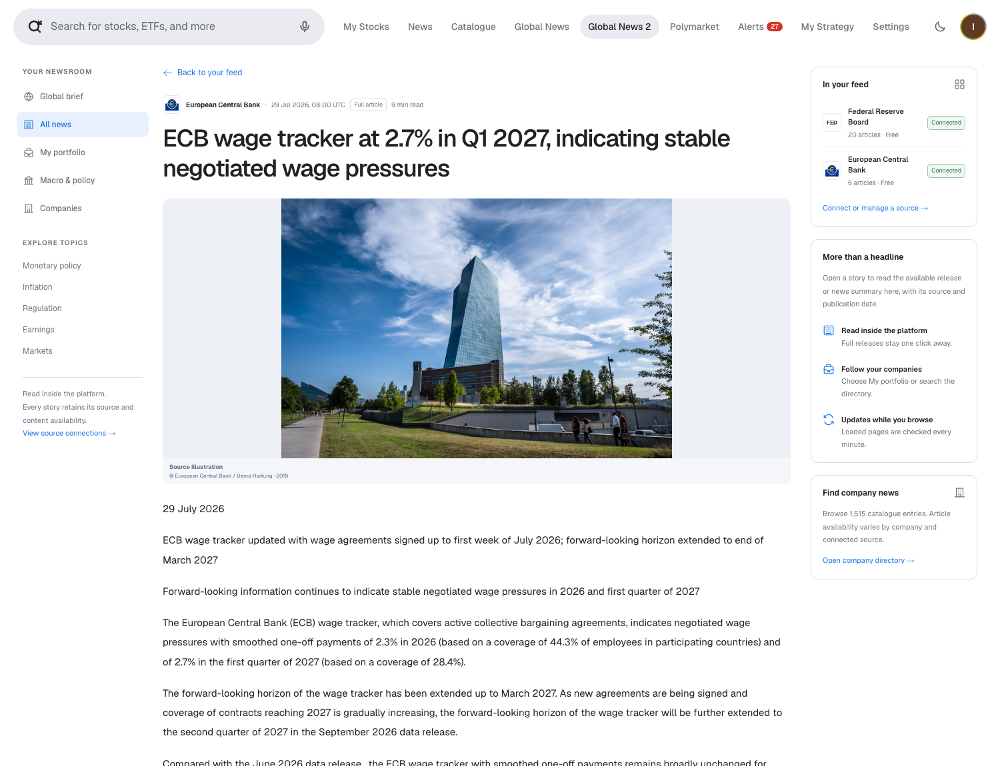
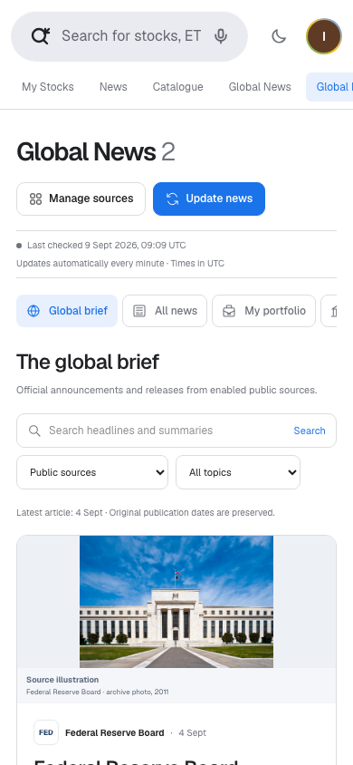
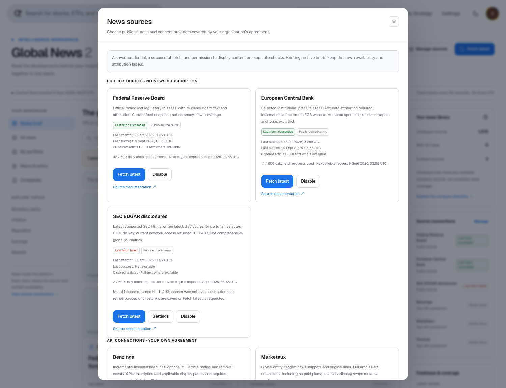

# Новости V2: аудит, новая архитектура и интерфейс

**9 сентября 2026 года.** Проверены текущий MVP, отдельный новостной сервис и каталог из 1 515 строк. Подробный технический документ: [News architecture V2](architecture.md).

**Текущий статус рабочей копии, 9 сентября 2026 года: семь открытых дефектов — два P1 и пять P2; R2 и R7 исправлены и проверены.** Первоначальная проверка выявила девять дефектов. Исправление R2 прошло четыре изолированных браузерных сценария, R7 — проверку временного сбоя и восстановления SEC на тестовых ответах. До подключения лицензированных лент необходимо устранить оставшиеся P1; остальные дефекты также требуют исправления и проверки до выпуска для клиентов. Поздние изменения пока не закоммичены. Исходные результаты, проверенные коммиты и отдельные сведения об исправлениях сохранены в [review.json](evidence/2026-09-09/review.json).

## Вывод

Текущую версию сохранили, а для следующего этапа создали отдельную страницу **Global News 2**. В ней есть бесплатные официальные публикации, чтение внутри платформы, выбор источников, подключение внешних API, поиск, каталог компаний, новости портфеля и отдельной компании.

Работающий локальный интерфейс подтверждает реализованные сценарии, но пока не подтверждает надёжное отключение контента, сохранность всех загружаемых статей и работоспособность внутреннего читателя в production. Независимая проверка воспроизвела ошибки в этих областях. Ниже разделены реализованное поведение, ограничения источников и ещё не устранённые дефекты.

Бесплатный вариант позволяет читать поддерживаемые официальные релизы без подписки на издателя. Он **не означает бесплатный доступ ко всем статьям Reuters, Bloomberg и других СМИ** и не обеспечивает полное покрытие 50 000 компаний. Для полноценной коммерческой ленты понадобится договор с поставщиком. Технический API-доступ и право показывать материал клиентам — разные условия.

## Что сохранено

В обоих Git-репозиториях создан тег `snapshot/news-v1-polymarket-20260909`. Исходные коммиты: MVP — `6e6c273`, новостной сервис — `c909cc2`. Новая работа ведётся в ветках `feature/news-v2`.

В приватной папке `.local-backups/news-v1-polymarket-20260909/` сохранены исходный код, история Git, отчёты, изображения, MVP, интеграция Polymarket, согласованные резервные копии SQLite/PostgreSQL и локальная конфигурация. Есть контрольные суммы и инструкция восстановления. Эта копия содержит приватные настройки и не предназначена для публичного GitHub. Старые материалы Polymarket не заменены новым новостным отчётом.

## Проблемы исходной архитектуры

В проекте фактически два набора данных: страницы News, My Stocks и исходный Catalogue используют SQLite и 50 компаний; Global News использует отдельный PostgreSQL-сервис с 1 515 строками каталога. Простая замена CSV сломала бы часть сопоставлений: различаются колонки, названия, страны и биржевые обозначения.

В базе обнаружено 38 244 статьи и 52 423 связи с компаниями. У 1 450 компаний были какие-либо сохранённые новости. Но последний запуск загрузки завершился **31 августа в 17:31 UTC**, обработал одну компанию и к моменту проверки был старше восьми суток. Наличие старых статей не подтверждает актуальность ленты.

| Проблема | Что изменено / предусмотрено |
| --- | --- |
| Планировщик повторно захватывал ту же блокировку | Устранена причина пропуска собственного задания |
| Хэш удалял кириллицу и другие не-ASCII символы | Сохраняются Unicode-буквы и цифры |
| Тайм-аут не всегда прекращал сетевую работу | Отмена передаётся в запросы и ограничители |
| Неполное окно API могло считаться завершённым | Добавлены курсоры и контроль завершения; ошибки большого курсора Finnhub, смены размера страницы Marketaux и частичного сбоя V1 остаются открытыми: R3, R8, R9 |
| Историческая статья могла означать «подключение работает» | Отдельно видны последняя попытка, успех, ошибка и квота источника |
| Тикер использовался как почти универсальный идентификатор | Сопоставляются компания и листинг; неоднозначные случаи показываются пользователю |
| Все заголовки уводили на сайты издателей | Добавлено внутреннее чтение и отдельная кнопка оригинала; ссылки старых страниц теперь ломаются в production: R5 |
| API-ключ смешивался с правами на контент | Платные источники выключены до настройки доступа и подтверждения прав; конкурентный отзыв доступа ещё требует исправления R1; ошибка пагинации R2 уже исправлена и проверена |

## Новая схема

Официальные RSS/API и подключённые поставщики → ограниченные задания в PostgreSQL → проверка структуры, времени и прав → статьи, версии и связи с компаниями → защищённый API → серверный прокси MVP → Global News 2.

Лента поставщика загружается один раз и связывается с несколькими компаниями. Открытие каталога или фильтра портфеля не запускает тысячи внешних запросов. У заданий есть сохранённые курсоры, блокировки, статусы и общий бюджет реальных HTTP-запросов. Сохраняются источник, оригинальная ссылка, время публикации/обновления/получения, режим чтения, версии и удаления. HTML издателя не исполняется внутри платформы.

Наличие этих механизмов не гарантирует корректность всех переходов состояния. Сейчас устаревшее обновление может восстановить отозванную статью (R4), исправление справочника не восстанавливает связи неизменившихся статей (R6), а временный сбой получения документа SEC может стереть ранее сохранённый текст (R7).

Это локальный MVP для одного рабочего пространства. Перед выпуском для клиентов нужны авторизация, разделение организаций и подписок, проверка договорных прав при каждом чтении, правила хранения/удаления и нагрузочные испытания. Эти возможности нельзя заменить одной галочкой в форме подключения.

## Источники и стоимость

| Источник | Что получаем | Доступ и ограничения |
| --- | --- | --- |
| Federal Reserve | Официальные денежно-кредитные и регуляторные релизы, поддерживаемый текст | Бесплатно, без API-ключа; атрибуция и исключения для чужих материалов [1] |
| ECB | Отобранные институциональные пресс-релизы | Бесплатно с условиями атрибуции; авторские исследования и выступления исключены. В платном продукте необходимо сообщать о бесплатном оригинале [2] |
| SEC EDGAR | Метаданные и поддерживаемые документы раскрытия компаний | Бесплатный публичный интерфейс; здесь реальные запросы вернули HTTP 403. Это пробел покрытия, а не успешное подключение [3] |
| Benzinga | Финансовые новости, связи с компаниями, обновления/удаления; полный текст при соответствующем доступе | API-токен и договорные права показа; стоимость для проекта пока не установлена [4] |
| Marketaux | Глобальные заголовки, короткие описания и сущности | Есть бесплатная API-квота, но коммерческий показ требует соответствующих условий. Полного текста нет и в платных планах [5] |
| Finnhub | Общая лента или ограниченный набор запросов новостей компаний | Персональный тариф не разрешает бизнес-использование даже внутри компании без письменного согласования [6] |
| LSEG/Reuters, Factiva | Корпоративные глобальные новостные продукты | Перспективные кандидаты для договорной интеграции; рабочие подключения в этом MVP не заявлены [7–8] |

Benzinga стоит рассмотреть первым для чтения полных лицензированных статей. Marketaux полезен для расширения географии и привязки коротких сообщений к компаниям. Его опубликованные месячные API-тарифы составляют $0 / $29 / $49 / $99 / $199; это не подтверждение стоимости лицензии на показ нашим клиентам. Точные квоты приведены в английской версии. [5]

Обычная подписка пользователя на сайт СМИ не обязательно включает API или право показывать статьи через другую платформу. Формы подключения принимают API-реквизиты; пароли от сайтов, cookies и обход платного доступа не используются. Без покупки источника остаётся бесплатная официальная лента. Инфраструктура и сопровождение при этом всё равно требуют ресурсов.

Проверка кода не изменила выводы об источниках, стоимости и правах: она не является новым разрешением на использование контента. Живые платные API без реквизитов не проверялись. Обнаруженные на тестовых ответах ошибки адаптеров относятся к нашей реализации и не доказывают, что поставщик возвращал такие ответы в рабочем подключении.

## Как это выглядит для пользователя

На Global News 2 доступны All news, Macro, My portfolio и компания из полного каталога. Можно выбрать только официальные источники, один подключённый источник или архив V1, искать новости и загружать следующую страницу. Отдельная панель показывает состояние источников и позволяет настроить подключение.

В последнем обновлении карточки получили более подробные выдержки из реального текста, оценку времени чтения и фотографии соответствующих учреждений с указанием авторства. Это иллюстрации источника Fed/ECB, а не фотографии конкретного описываемого события. Для коммерческих подключений добавлены узнаваемые логотипы; государственные печати не используются. Недоступные официальные источники без статей скрыты из фильтров по умолчанию и сгруппированы в неактивных настройках. Дополнительные платные подключения остаются доступны для выбора.

API дополнен необязательными полями `previewText` и `readingMinutes`. Выдержка — дословный фрагмент разрешённого полученного текста длиной до 700 символов; при отсутствии разрешённого полного текста используется исходное краткое описание. Это не автоматически придуманное резюме, исходное описание поставщика не меняется. Время чтения оценивается по полному разрешённому тексту из расчёта 200 слов в минуту. Полный текст по-прежнему загружается отдельно при открытии читателя.

В текущей ленте V2 показываются записи с разрешённым непустым текстом либо содержательным описанием: минимум 80 символов, из которых минимум 40 букв/цифр остаются после исключения повторённого заголовка. Фильтрация выполняется до пагинации. Записи без доступного содержимого скрываются из текущей ленты, но сохраняются в базе для последующего восстановления. Отдельно выбираемый архив не изменён.

В итоговой проверке сопоставлены все три текущие позиции портфеля. Для ASML/NASDAQ и Alphabet Class A/GOOGL добавлены отдельные проверенные соответствия с первоисточниками, датой проверки и сроком пересмотра; общие правила сопоставления не ослаблены. Подтверждение соответствия не означает наличие свежих новостей по этой компании. [9–10]

Отдельное, ранее описанное ограничение Finnhub сохраняется: адаптер фиксирует запрошенный тикер, но без проверенного соответствия конкретному листингу этого недостаточно для привязки статьи к компании и портфелю. Три успешных сопоставления текущих позиций не устраняют ни этот пробел, ни ошибку повторного сопоставления R6.

В проверенном локальном сценарии нажатие на новость открывает материал внутри платформы. Если получен разрешённый полный текст — показывается текст. Если API вернул только краткое описание — это обозначено как News brief. Записи только с заголовком и ссылкой могут оставаться в архиве, но исключаются из текущей ленты V2. Оригинал открывается отдельным осознанным действием; на сайте издателя может потребоваться подписка. Исходная проверка показала повторный показ отключённого источника через отложенную пагинацию (R2); исправление в рабочей копии теперь прошло четыре браузерных сценария.

В исходных All News, My Stocks, новостях компании и Global News заголовки также переведены во внутренний читатель. Это создало регрессию: его общий защитный фильтр отклоняет запросы в production с HTTP 403; путь чтения архива сервиса дополнительно зависит от настройки V2 (R5). Страница компании получила переход к её новостям V2 после проверки соответствия. Из Catalogue можно открыть полный новостной справочник, не загружая котировки всех 1 515 компаний сразу.

## Актуальность и достоверность

Официальное происхождение повышает проверяемость, но не доказывает истинность каждого утверждения. Пресс-релиз компании остаётся заявлением компании. Мы сохраняем источник и время, отделяем публикации институтов от СМИ и агрегаторов, показываем исправления и не выдаём совпадение названия за доказанное влияние на цену акции.

Официальные источники проверяются раз в **15 минут**. В первоначально проверенной версии чтение первой страницы из локального кэша происходило раз в **60 секунд**, а после пагинации или открытия статьи приостанавливалось; сохранённые страницы оставались после отключения источника. Теперь все загруженные страницы перепроверяются раз в 60 секунд, старые ответы пагинации отклоняются после изменения доступа, а карточки отозванного источника удаляются после обнаружения изменения при 30-секундной проверке статуса. Исправление R2 прошло четыре изолированных браузерных сценария; интервалы опроса и сетевые задержки сохраняются. Для подключённых платных API задан интервал пять минут с учётом квоты. Это периодическое обновление, **не гарантированная лента в реальном времени**. Загружаются все допустимые записи текущего ограниченного RSS-снимка с продолжением по порциям, а не весь исторический архив. Неизменившиеся тексты релизов перепроверяются раз в сутки; исправление без изменения RSS-метаданных может появиться с такой задержкой. Время проверки и дата публикации показаны отдельно.

При ошибке повторного получения текста Fed/ECB уже сохранённый материал теперь остаётся неизменным, даже если RSS-метаданные обновились. После временного сбоя предусмотрено до трёх дополнительных попыток на следующих проверках ленты, затем — обычная суточная перепроверка, с учётом квот. Ответ HTTP 401/403 для документа фиксируется без автоматических повторов; повтор требует явного сброса контрольной точки источника. Временный сбой документа SEC больше не создаёт обновление с пустым текстом; следующий ограниченный снимок может повторить получение. Ошибки доступа SEC передаются обработчику, который приостанавливает автоматические запросы. Обход блокировок не применяется.

Бесплатные Fed/ECB дают прежде всего макроэкономические и регуляторные материалы США/еврозоны. Они не заменяют глобальное покрытие компаний. SEC здесь недоступен; новые бесплатные новости компаний пока нельзя считать обеспеченными. Пустой фильтр не означает, что у компании не было событий.

## Рост до 10 000–50 000 компаний

При 55 запросах в минуту один проход по 10 000 компаниям занимает примерно три часа, по 50 000 — пятнадцать часов. Опрос каждой компании раз в пять минут потребовал бы соответственно 2,88 и 14,4 миллиона запросов в сутки. Увеличение параллельности не решает ограничение квот.

Нужны потоки поставщиков с достаточной договорной ёмкостью, массовая начальная загрузка, единый справочник эмитентов/бумаг/листингов, история переименований, качественное сопоставление сущностей, индекс поиска и измеряемый контроль задержек. Производительность следует проверять по объёму статей и одновременным пользователям, а не только по числу строк CSV. Текущий прототип не сертифицирован нагрузочным тестом на 50 000 компаний.

До расширения каталога нужен отдельный механизм повторного сопоставления уже сохранённых статей: сейчас неизменившийся текст пропускается вместе с обновлением связей, даже если компания или её идентификаторы исправлены (R6). Увеличение числа строк каталога само по себе этот пробел не устраняет.

## Реальный интерфейс

### Обновление: подробные карточки и фотографии источников

*Фотографии обозначают учреждение-источник и не выдаются за снимки событий из текущих заголовков. Подпись Fed: Federal Reserve Board, архивная фотография 2011 года, [официальная страница загрузки](https://www.flickr.com/photos/federalreserve/26088200676/sizes/l/). Подпись ECB: © European Central Bank / Bernd Hartung, архивная фотография 2019 года; [условия пресс-фото ECB](https://www.ecb.europa.eu/press/contacts/html/press_photos.en.html) требуют указания источника и запрещают изменение/искажение. Кадр и пропорции сохранены. Адреса, основания использования и контрольные суммы находятся в `public/news-sources/README.md` и `manifest.json` репозитория MVP. Логотипы не означают одобрение, партнёрство или приобретённые права на новости. Дополнительные снимки: `news-v2-rich-providers-mobile.png` и `news-v2-rich-dark.png`.*

### Исходные снимки, сохранённые как история проверки

*Исходный снимок работающего MVP от 9 сентября 2026 года, до последующего обновления фотографий и карточек. Видны даты публикаций, состояние источников и различие между размером каталога и покрытием новостями.*

*Реальный релиз Federal Reserve от 4 сентября, с полученным текстом и ссылкой на оригинал. Это не демонстрационные новости.*

*Платные источники не подключены автоматически. Доступ к API и право на полный текст задаются отдельно.*

*Сопоставлены три позиции; показаны 18 реальных архивных материалов. Самая свежая публикация датирована 31 августа. Интерфейс явно показывает возраст данных и режим архива.*

## Проверка и запуск

Отдельный сервис V2 работает на localhost:8081, исходный — на 8080. В MVP настроены серверный адрес V2 и общий токен; ключ шифрования остаётся только в сервисе. Миграция добавляет таблицы, сохраняя V1. Платные API не подключены и не оплачены автоматически. Снимки реального интерфейса и результаты проверки сохранены рядом с английским отчётом; тестовые фикстуры не выдаются за реальные новости.

Получено **20 релизов Fed и 6 ECB**, SEC — ноль из-за HTTP 403. Новых V2-новостей компаний пока нет; доступные бесплатные материалы относятся к макроэкономике и регулированию. Архив V1 выбирается отдельно. При первоначальной проверке пройдены 127 тестов сервиса, 6 проверок PostgreSQL с откатом, 19 регрессионных тестов Polymarket, 14 локальных API-проверок, сборки и браузерные проверки. Эти результаты остаются свидетельством именно проверенных тогда сценариев; они не покрыли девять дефектов ниже и не подтверждают их исправление. Платные каналы без пользовательских API-реквизитов проверены только на тестовых ответах.

Последующая проверка новой логики чтения без изменения базы подтвердила **26 видимых релизов с разрешённым полным текстом у всех 26**. Тексты Fed содержат 284–3 364 символа, ECB — 1 827–11 172; выдержки в ленте — 282–700 символов. Ограниченная проверка реальной страницы ECB подтвердила полноту извлекаемого текста. В этой выборке не было записей только с заголовком, которые потребовалось бы скрыть. После изменений пройдены **24 теста поставщиков**, **7 проверок PostgreSQL с откатом**, проверка TypeScript и форматирования. Они подтверждают исправление R7, сохранение текста и повторы официальных запросов, пагинацию читаемых записей и соблюдение прав в выдержках; остальные дефекты автоматически не закрываются.

После перезапуска локального V2-сервиса ограниченные ручные проверки Fed и ECB успешно завершились примерно в **09:03 UTC 9 сентября**; количество материалов осталось прежним — 20 и 6. В полном наборе сервиса прошли **131 офлайн-тест**; также прошли **19 регрессионных тестов Polymarket**, TypeScript/ESLint интерфейса и четыре изолированных браузерных сценария пагинации/отзыва доступа. Браузерные сценарии подтверждают исправление R2 отдельно от проверки R7 на ответах поставщика. Семь других дефектов остаются открытыми.

## Независимая проверка реализации: девять находок, семь открыты

**Первоначальная проверка: 9 сентября 2026 года, девять дефектов. Текущий статус: семь открыты, R2 и R7 исправлены в рабочей копии.** Три независимые технические проверки охватили интерфейс, поставщиков и обработку заданий/хранение. Сценарии воспроизведены на изолированных синтетических ответах API, в браузере с подменёнными ответами и в транзакциях PostgreSQL с последующим откатом. Это проверка поведения нашего кода, а не испытание живых платных лент. Сама исходная проверка не меняла приложение и настройки реальных платных поставщиков. Поздние сведения о проверенных исправлениях R2 и R7 добавлены отдельно, без изменения исходных наблюдений. Сводка доказательств: [review.json](evidence/2026-09-09/review.json).

Проверенные коммиты: MVP — `f4d148137638c80a1888b77ede3d0d6e763f0d70`; новостной сервис — `3005fa47056f581b23dbe2c902ae1572bc4f8ca9`.

P1 здесь означает дефект, который нужно устранить до подключения лицензированного источника; P2 — существенный дефект корректности или регрессия, также требующий исправления до выпуска соответствующего сценария для клиентов. Нумерация стабильна и совпадает с английским отчётом. Пути `src/features/global-news-v2/…` и `src/features/global-news/providers/…` относятся к репозиторию `news-service`; условный префикс `mvp/` обозначает корень отдельного репозитория MVP, а не каталог на диске. Номера строк относятся к проверенной версии.

### R1 — P1: одновременные изменения настроек восстанавливают отозванный доступ

**Триггер и результат.** Два частичных запроса читают старые настройки до получения блокировки. Первый отключает поставщика и право показа; второй меняет только режим полного текста, но затем записывает обратно ранее прочитанные `enabled=true` и `displayLicensed=true`. В транзакционном воспроизведении отключённый доступ снова оказался включён.

**Место:** `src/features/global-news-v2/store.ts:34–52`, чтение и объединение настроек до блокировки поставщика.

**Необходимое исправление и приёмка.** Читать актуальную запись и объединять частичные изменения внутри транзакции после получения блокировки. При конкурентном отзыве доступа и изменении несвязанного поля результат должен сохранять отключение; тест должен проверять оба порядка запросов. **Статус: открыт.**

### R2 — P1: пагинация возвращает статьи отключённого поставщика

**Триггер и результат.** Пользователь запускает «Load older stories», отключает поставщика и получает обновлённую пустую ленту. Затем приходит старый ответ пагинации: в браузерном воспроизведении снова появились две карточки отключённого источника. После включения пагинации обычный опрос ленты также прекращается. Подтверждено повторное отображение заголовков и кратких описаний; обход проверки полного текста этим сценарием не доказан.

В отдельном сценарии после загрузки двух страниц имитировалось отключение источника из другой вкладки. Через шесть минут статус уже показывал Disabled, но обе карточки оставались: запросы статуса продолжались, а запросы ленты прекратились.

**Место:** `mvp/src/features/global-news-v2/components/GlobalNewsV2.tsx:69`, `:125`, `:130` — остановка опроса, приём старого ответа и неполный сброс при изменении подключений.

**Необходимое исправление и приёмка.** Отменять запросы пагинации и отклонять ответы прежней версии настроек, сбрасывать все сохранённые страницы при изменении доступа и сохранять проверку актуальности после пагинации. В браузерных тестах задержанный ответ не должен восстанавливать карточки, а отключение источника из другой вкладки должно убирать его материалы. **Статус: исправлен в незакоммиченной рабочей копии, браузерная проверка пройдена 9 сентября 2026 года.**

**Подтверждение исправления.** При изменении доступа или настроек старые запросы инвалидируются, все загруженные страницы перепроверяются раз в минуту, а карточки фильтруются по актуальному доступу. Пройдены четыре браузерных сценария с перехватом всех API-запросов: задержанная пагинация после отключения источника; отключение из другой вкладки; исправление/отзыв на уже загруженной последующей странице; ошибка последующей страницы без сохранения устаревших материалов. Ошибок JavaScript не было; настройки реальных платных источников не менялись. Результаты: [pagination-fix-validation.json](evidence/2026-09-09/pagination-fix-validation.json). Исходные снимки ошибки ниже сохранены как исторические доказательства.

### R3 — P1: большой ответ Finnhub останавливает загрузку

**Триггер и результат.** Адаптер сохраняет ещё не обработанные статьи целиком в курсоре продолжения. В тесте ответ из 220 статей с описаниями по 700 символов создал курсор длиной 242 156 символов, превышающий ограничение обработчика в 100 000. Размер результата сопоставлен с фактической проверкой в коде обработчика: такой курсор отклоняется до сохранения первой порции, поэтому она не будет записана, а повтор того же ответа не даст продвижения. Полное задание обработчика в этом сценарии не запускалось.

**Место:** `src/features/global-news-v2/providers/paid.ts:178–183` и `src/features/global-news-v2/worker.ts:88`.

**Необходимое исправление и приёмка.** Использовать ограниченный по размеру курсор и отдельное надёжное хранение ожидающих статей либо другой способ последовательной обработки без потери записей. Ответ из воспроизведения должен полностью сохраняться за конечное число заданий, включая перезапуск между порциями, без превышения лимита курсора. **Статус: открыт.**

### R4 — P2: устаревшее обновление восстанавливает отозванную статью

**Триггер и результат.** Сначала сохраняется обновление на 10:05, затем удаление без времени обновления, после него повтор старой версии на 10:01. Запись об удалении обнуляет `updated_at`, и старое сообщение снова становится допустимым. В транзакционном воспроизведении восстановились статья и её лицензированный текст.

**Место:** `src/features/global-news-v2/store.ts:185–192`; формирование удаления без времени обновления — `src/features/global-news-v2/providers/paid.ts:114–117`.

**Необходимое исправление и приёмка.** Сохранять данные о порядке событий и состояние отзыва, отклонять устаревшие повторы; определить отдельное правило подтверждённого восстановления источником. Последовательность «новая версия → удаление без времени → старая версия» должна оставлять статью удалённой, включая повторную обработку после перезапуска. **Статус: открыт.**

### R5 — P2: внутренние ссылки исходных новостных страниц не работают в production

**Триггер и результат.** Заголовки исходных All News, My Stocks, новостей компании и Global News переведены на общий внутренний читатель. Его маршрут безусловно применяет защиту локального V2, которая при `NODE_ENV=production` возвращает HTTP 403. Таким образом, ограничение экспериментальной страницы затронуло ранее существовавшие страницы. Чтение архива сервиса дополнительно требует адреса и токена V2.

**Место:** `mvp/src/app/api/reader/[namespace]/[id]/route.ts:7–8`; проверка окружения — `mvp/src/features/global-news-v2/lib/news-v2.ts:14–15`.

**Необходимое исправление и приёмка.** Отделить ограничения локального прототипа от поддерживаемого читателя либо сохранять рабочую ссылку на оригинал, когда внутреннее чтение недоступно. Проверить переходы со всех исходных страниц после production-сборки и без настройки сервиса V2; доступ должен соответствовать выбранной модели авторизации. **Статус: открыт.**

### R6 — P2: исправление каталога не восстанавливает связи старых статей

**Триггер и результат.** После добавления отсутствующей компании или исправления её идентификаторов повторно обрабатывается статья с тем же содержимым. Проверка неизменившегося хэша завершает обработку раньше пересчёта связей с компаниями. Статья остаётся недоступной через нужную компанию или портфель, несмотря на исправленный справочник.

**Место:** `src/features/global-news-v2/store.ts:186`, `:195–198`.

**Необходимое исправление и приёмка.** Пересчитывать связи независимо от изменения текста либо добавить явную повторную обработку по версии справочника. Тест должен импортировать несопоставленную статью, исправить каталог и получить нужную связь без изменения статьи и без создания лишней редакции текста. **Статус: открыт.**

### R7 — P2: временный сбой SEC удаляет ранее полученный текст

**Триггер и результат.** Первая загрузка документа успешна. При следующем опросе метаданные доступны, но запрос самого документа возвращает HTTP 503. Адаптер выдаёт завершённый результат с `body=null`, который заменяет ранее сохранённый текст. Сценарий воспроизведён на тестовых ответах; реальные запросы SEC в этой среде по-прежнему ограничены HTTP 403.

**Место:** `src/features/global-news-v2/providers/sec.ts:95–107` и последующее сохранение статьи.

**Необходимое исправление и приёмка.** Отличать временную ошибку получения текста от явного удаления или запрета его использования. Сохранять предыдущий разрешённый текст при HTTP 503 и повторять получение; тест должен подтвердить сохранность текста при сбое и принятие обновления после восстановления.

**Исправление от 9 сентября 2026 года: выполнено в незакоммиченной рабочей копии.** В `src/features/global-news-v2/providers/sec.ts` временный сбой документа теперь пропускает обновление статьи, а не создаёт новую редакцию с пустым текстом. Следующий ограниченный SEC-снимок может повторить запрос; HTTP 401/403 передаётся обработчику, который приостанавливает автоматическое получение. Тест в `test/global-news-v2/v2-providers.test.ts` проверяет последовательность «успех → HTTP 503 документа → восстановление»: при сбое заменяющая запись не создаётся, при восстановлении текст того же документа снова доступен. Таким образом, неудачный запрос не перезаписывает сохранённый текст. Пройдены все 24 теста поставщиков и семь проверок базы с откатом. Это проверка на тестовых ответах, а не подтверждение живого подключения SEC; ограничение HTTP 403 остаётся.

### R8 — P2: изменение размера страницы Marketaux пропускает статьи

**Триггер и результат.** Курсор запоминает номер страницы, но не фактический размер страницы, ограниченный тарифом. В воспроизведении первая страница вернула записи 1–3. После изменения эффективного размера с 3 до 40 следующая страница вернула записи 41–50, а окно признано завершённым: 37 из 50 статей пропущены. Это модель смены тарифного ограничения во время продолжения загрузки, а не наблюдение живого платного подключения.

**Место:** `src/features/global-news-v2/providers/paid.ts:60–83`.

**Необходимое исправление и приёмка.** Сохранять фактический размер страницы в состоянии окна или обнаруживать его изменение и безопасно переигрывать окно с устранением дублей. Переходы между размерами страницы в обе стороны должны сохранять все 50 тестовых записей до продвижения границы загрузки. **Статус: открыт.**

### R9 — P2: ошибка поздней страницы Marketaux V1 отбрасывает успешные результаты

**Триггер и результат.** Первая страница исходного адаптера V1 успешно возвращает три статьи, а следующая — HTTP 429. Обработка ошибки отбрасывает уже полученные три записи. Поэтому доработку курсора нельзя считать гарантией сохранения всех успешно прочитанных страниц.

**Место:** `src/features/global-news/providers/marketaux.ts:178–203`, `:273–285`.

**Необходимое исправление и приёмка.** Передавать на сохранение проверенные частичные результаты, отмечать окно незавершённым, сохранять прежнюю подтверждённую границу и показывать причину сбоя. При сценарии «три статьи → HTTP 429» три статьи должны сохраняться; повтор должен догружать оставшееся без потерь и дублей. **Статус: открыт.**

### Синтетический пример из проверки

*R2: все API-запросы браузера перехвачены тестовой средой. Это вымышленные тестовые карточки, а не реальные статьи Benzinga или подтверждение платного подключения. Лента сначала очистилась, после старого ответа вернулись две карточки. Отдельный шестиминутный сценарий также зафиксирован в реестре доказательств.*

Известные ограничения — недоступность SEC в этой среде, отсутствие платных API-реквизитов, локальный режим V2 и отсутствие испытания на 50 000 компаний — остаются отдельными ограничениями и не включены в число девяти находок. R2 и R7 закрыты только после описанных выше поздних исправлений и целевых браузерных/провайдерских проверок. Первоначальные успешные тесты не подтверждают исправление остальных сценариев.

## Источники

1. [Federal Reserve: условия использования](https://www.federalreserve.gov/disclaimer.htm).
2. [ECB: copyright и условия повторного использования](https://www.ecb.europa.eu/services/using-our-site/disclaimer/html/index.en.html).
3. [SEC: EDGAR API](https://www.sec.gov/search-filings/edgar-application-programming-interfaces); [публичные материалы](https://www.sec.gov/about/webmaster-frequently-asked-questions).
4. [Benzinga: официальная документация](https://docs.benzinga.com/introduction/faq).
5. [Marketaux: FAQ](https://www.marketaux.com/faq), [тарифы](https://www.marketaux.com/pricing), [условия](https://www.marketaux.com/tos).
6. [Finnhub: бизнес-использование и распространение](https://finnhub.io/terms-of-service).
7. [LSEG: News](https://developers.lseg.com/en/product/news/overview).
8. [Dow Jones: официальный Factiva SDK](https://github.com/dowjones/factiva-analytics-python).
9. [ASML: официальные листинги акций](https://www.asml.com/en/investors/shares).
10. [Alphabet: Class A/GOOGL в отчётности за II квартал 2026](https://www.sec.gov/Archives/edgar/data/1652044/000165204426000071/R1.htm).
