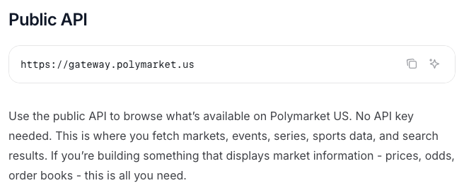
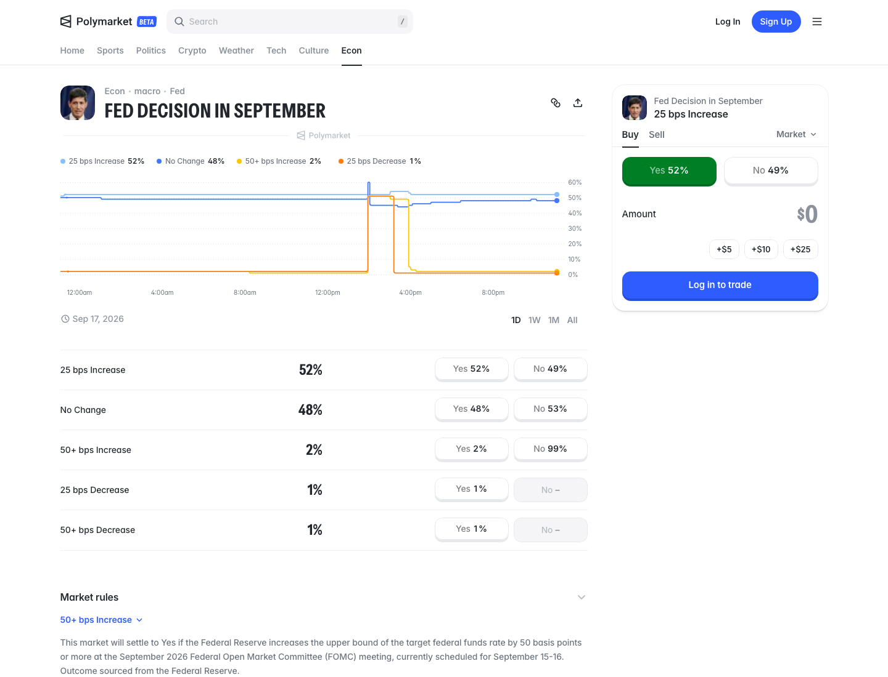
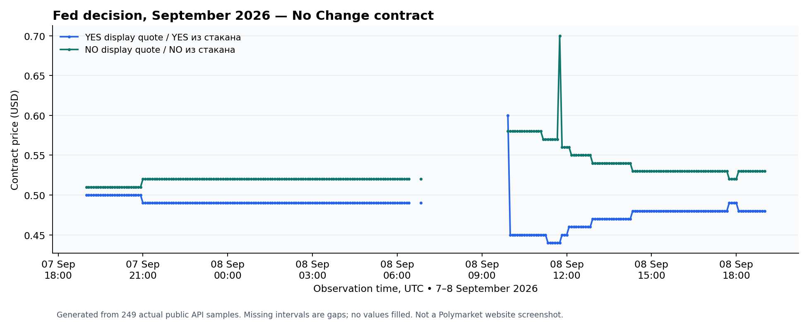
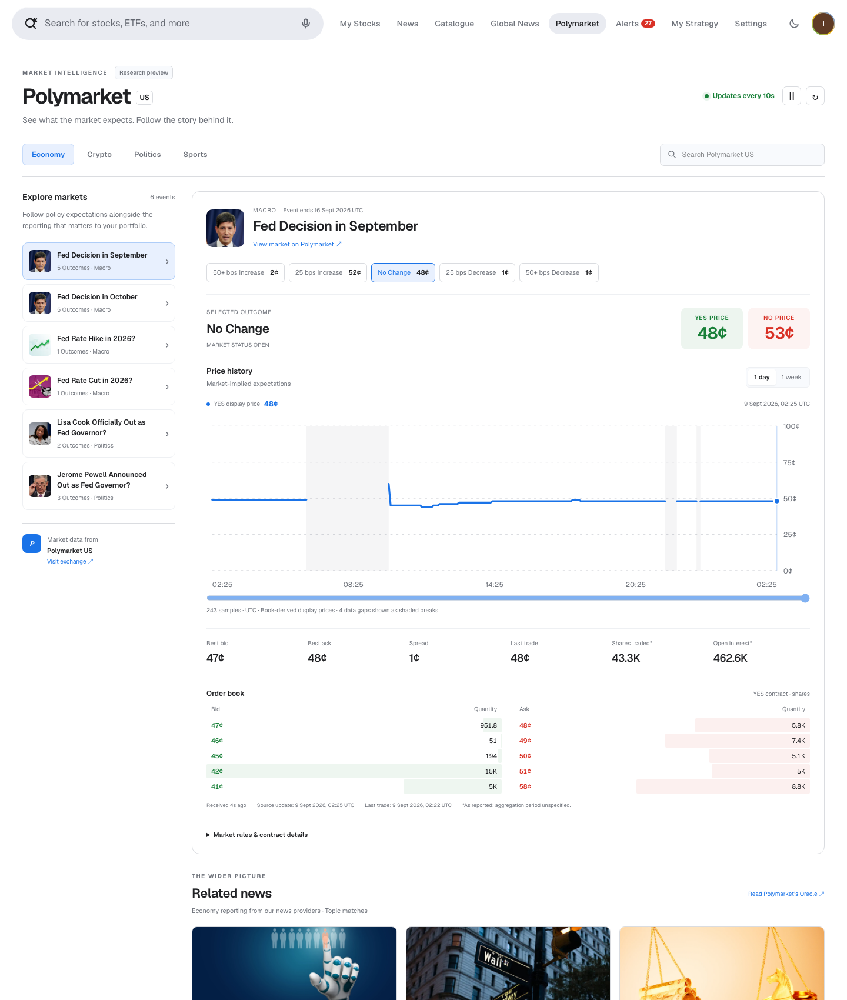
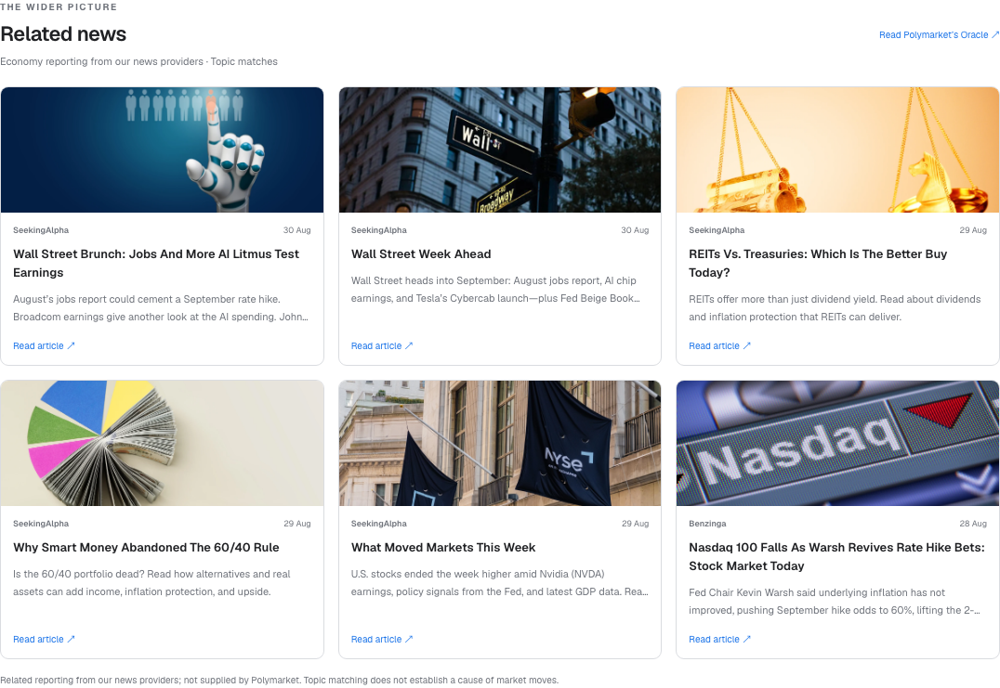

# Polymarket US — доступные данные и реальные примеры

**Обновлено 9 сентября 2026 года; сохранённые ответы API получены 8 сентября.**
Время API и снимков указано в UTC. Скриншоты
сохраняют подписи дат самого сайта. Мы получили
структурированные публичные данные напрямую от Polymarket US без входа в
аккаунт, cookies, API-ключа и VPN. Примеры подтверждают техническую возможность
внутреннего блока рыночного контекста. Они не подтверждают права компании,
полноту покрытия или надёжность рабочего сервиса. Отчёт и материалы проверки
остаются локальными; на GitHub они не опубликованы. Локальный интерактивный MVP
реализован и проверен; его снимки и проверка 9 сентября описаны отдельно ниже.

Приложение **`Polymarket-Data-Inventory.xlsx`** содержит подробный перечень и
значения примеров. Исходные ответы и журнал запросов находятся в
`evidence/2026-09-08/`. Для каждого запроса сохранены URL, HTTP-статус,
время отправки и получения, хеш SHA-256. Основные ответы получены в
19:02:54–19:02:56; результат расчёта завершённого рынка — в 19:03:47.
Это наблюдения в указанные моменты, а не актуальные торговые рекомендации.[^1]

Лист `AllObservedFields` перечисляет все конечные поля, полученные в 13 ответах:
индексы массивов объединены в `[]`, указаны типы, число наблюдений и до трёх
реальных примеров. `FieldExamples` поясняет выбранные поля. Это полный перечень
полей именно сохранённых ответов; необязательные поля документации и общий
каталог биржи могут быть шире. У нового графика отдельный источник `MVPHistory`.

## 1. Что доступно без аккаунта

Публичный адрес — **`https://gateway.polymarket.us`**. Выполнены 13 запросов:
12 вернули HTTP 200; запрос окончательного расчёта открытого рынка — HTTP 404.
Официальная документация описывает этот API как достаточный для приложений,
показывающих рыночную информацию. [^2].

| Данные | Реальный проверенный ответ | Применение |
| --- | --- | --- |
| Поиск и событие | Одно событие ФРС с пятью контрактами | Находить темы и группировать связанные исходы |
| Определение рынка | ID, вопрос, правила, даты, статус, стороны и котировки | Объяснять, к чему относится число |
| Изображения событий и рынков | URL изображений, включая портрет события ФРС и логотип спортивной команды | Оформление события; не изображения статей и не лицензия на повторное использование |
| Лучшие покупка/продажа, BBO | Котировки, последняя цена, число уровней и статистика | Карточка котировки и спред |
| Стакан | 13 уровней покупки и шесть продажи | Контекст глубины и ликвидности |
| История цен | 249 точек за суточное окно и 57 за недельное | Графики отображаемых цен |
| Окончательный расчёт | 404 для открытого рынка; значение 1 для рассчитанного | Отделять незавершённые события от результатов |
| Справочники | Две серии, две лиги и пять тегов | Навигация и классификация |

Размеры справочных выборок заданы запросами: это не полное количество записей
в каталоге. Постоянный сборщик в рамках той проверки не запускался.
Обновление данных в локальном MVP описано в разделе 9.

*Реальный снимок официальной документации из браузера, сделанный
2026-09-08 в 19:11:16.306 UTC. Это изображение документации, а не ответ API.*

## 2. Реальный макропример: сентябрьское решение ФРС

Поиск `GET /v1/search?query=Fed&limit=1` вернул событие **65124**, slug
`usfed-fomc-2026-09-16`. Подробный ответ содержал пять контрактов: все активны
и открыты. Категория события — `macro`; среди тегов — `Econ`, `macro` и `Fed`.
Котировки ниже взяты из **одного сохранённого ответа события**, полученного
в 19:02:54.365 UTC, а не собраны из разных моментов.

| Название контракта | ID рынка | Лучшая покупка, USD | Лучшая продажа, USD |
| --- | --- | --- | --- |
| Повышение на 50+ б.п. | 313136 | 0.0100 | 0.0200 |
| Повышение на 25 б.п. | 313137 | 0.5100 | 0.5200 |
| Без изменений | 313138 | 0.4700 | 0.4800 |
| Снижение на 25 б.п. | 313139 | Не передана | 0.0100 |
| Снижение на 50+ б.п. | 313140 | Не передана | 0.0100 |

Поля: `event.markets[].bestBidQuote.value` и
`event.markets[].bestAskQuote.value`. Отсутствующая покупка — не ноль. Нельзя
просто нормировать эти цены и получать придуманное распределение вероятностей.
Перед объединением контрактов необходимо сопоставить определения исходов и
правила окончательного расчёта.

*Реальный снимок сайта Polymarket US, сделанный 2026-09-08 в 19:04:10.892 UTC.
Это отдельное наблюдение после запросов API: цены на изображении могут
отличаться. Источник: [^3].*

## 3. Определение контракта и соответствие полей

Мы проверили `GET /v1/market/slug/rdc-usfed-fomc-2026-09-16-nochng`.
В этом адресе используется единственное число `/market/slug/`, в отличие
от адресов котировок и стакана. Объект `market` описывал контракт
**«Без изменений»**, ID **313138**. Правила связывают расчёт с верхней границей
целевого диапазона ставки федеральных фондов на сентябрьском заседании FOMC;
источником решения названа ФРС. В согласованной интеграции нужно сохранять
полные правила. Здесь приведён пересказ, а не копия текста контракта.

| Путь к полю | Значение или смысл |
| --- | --- |
| `market.slug` | `rdc-usfed-fomc-2026-09-16-nochng` |
| `market.status` | `MARKET_STATUS_OPEN`; `closed` равно false |
| `market.marketSides[].id` | Yes: 625838; No: 625839 |
| `market.marketSides[].long` | Yes: true; No: false |
| `market.marketSides[].quote.value` | Yes: 0.4800; No: 0.53 |
| `market.orderPriceMinTickSize` | 0.01 |
| `market.minimumTradeQty` | 0.01 |

Обнаружены два существенных расхождения. У события `endDate` — 16 сентября,
23:59, а у контракта — 30 сентября, 23:00. Нужно сохранять обе даты и их
смысл; определять дату заседания только по одному из этих полей нельзя.
Старые массивы `outcomes`/`outcomePrices` также оказались неполными или
вводящими в заблуждение: у снижения на 50+ б.п. две подписи исходов и лишь
одна цена. Проверять нужно явные идентификаторы сторон и поля котировок,
а не просто объединять старые массивы по индексу.[^4]

## 4. Котировки, глубина и статистика торгов

Для того же контракта «Без изменений» ответ BBO содержал:

| Путь внутри `marketData` | Значение |
| --- | --- |
| `bestBid.value` / `bestAsk.value` | 0.4700 / 0.4800 USD |
| `lastTradePx.value` / `currentPx.value` | 0.4800 / 0.4700 USD |
| `longQuote.value` / `shortQuote.value` | 0.4800 / 0.53 USD |
| `bidDepth` / `askDepth` | 13 / 6 |
| `sharesTraded` / `openInterest` | 37233.5500 / 456927.4600 |

Стакан подтвердил `marketData.bids[0]`: цена **0.4700**, количество
**566.1400**; `marketData.offers[0]`: цена **0.4800**, количество
**5129.0200**. Спред — 0.0100 USD. Это выставленные количества в момент
наблюдения, а не гарантированное исполнение или доказательство постоянной
ликвидности. Глубину нужно измерять повторно в согласованном пилоте.

Объект `stats` дополнительно содержит открытие/максимум/минимум/закрытие,
количество последней сделки, оборот и отдельные моменты обновления. Например,
`lastTradeQty` равнялось **0.3800**, а `lastTradeSetTime` — **19:00:56.848 UTC**,
примерно за две минуты до запроса. `notionalTraded.value` — **1828974.7500**
с валютой `USD`. Значение нужно сохранить как сообщённое поставщиком, а единицы
и период измерения проверить до расчёта оборота. Наличие поля не подтверждает
правильность нашей интерпретации.

Все цены нельзя сводить к одному показателю «вероятность». Текущая цена,
последняя сделка, котировки покупки/продажи и исторические отображаемые цены
различаются даже в этих ответах. Пользователь должен понимать, что именно
показывает карточка и когда это значение обновилось.
[^5],[^6]

## 5. История: данные есть, но есть и пропуски

Оба запроса выполнены к `/v1/price-history`, где `symbol` — slug контракта.
Каждый элемент `history[]` содержит `timestamp` в секундах Unix,
`longPrice` и `shortPrice`. Это отображаемые цены, рассчитанные из стакана,
а не перечень исполненных сделок.

| Параметры запроса | Реальное покрытие ответа |
| --- | --- |
| `fixedInterval=INTERVAL_1D&fidelity=5` | 249 точек; 7 сентября 19:00 — 8 сентября 19:00 |
| `fixedInterval=INTERVAL_1W&fidelity=180` | 57 точек; 1 сентября 18:00 — 8 сентября 18:00 |

Недельные точки расположены через три часа. Суточные — преимущественно через
пять минут, но 8 сентября есть разрывы **06:25–06:50** и **06:50–09:55**.
Ответ не объясняет причину пропусков. Нельзя придумывать значения между
наблюдениями или обещать пользователю полный исторический архив. Пустой участок
графика должен оставаться отличимым от периода неизменной цены.

Последняя суточная точка: **0.48 long / 0.53 short**. Сумма больше единицы,
поскольку это цены двух сторон со спредом, а не две взаимодополняющие
проверенные вероятности. При этом в текущем `lastPriceSample.shortPx` было
0.52. При сравнении ответов сохранять название поля и время наблюдения,
а не автоматически заменять одно значение другим.[^7]

*График построен из реально сохранённых исторических точек. Это наша
визуализация, а не снимок интерфейса Polymarket; пропуски не заполнены
выдуманными значениями.*

## 6. Окончательный расчёт и справочники

Специальный endpoint расчёта открытого контракта ФРС вернул **404** с сообщением
«Settlement not found». Однако BBO/стакан содержали
`settlementPx.value=0.5000`. Следовательно, это поле само по себе не доказывает
окончательный исход события. Для отдельного завершённого спортивного контракта
`aec-nfl-lac-ten-2025-11-02` получили **200** и `settlement: 1`; его статус —
`MARKET_STATUS_RESOLVED`. Итог нужно связывать с состоянием рынка и
идентичностью стороны, а не только с числом.[^8]

Получены серии **NFL** и **NFL 2025**, лиги **UEFA** и **MLB**, пять тегов,
включая **Supreme Court**: ID, названия, slug и некоторые связи между записями.
Тег не доказывает наличие активного или ликвидного рынка. Команды и расписания
описаны в документации, но отдельно не запрашивались.

## 7. Изображения и новости: разные источники контента

Публичная схема рынка содержит `image`, изображения объектов и логотипы команд.
Реальные ответы включали оформление событий: в `image` события ФРС был URL
портрета, а спортивный контракт ссылался на логотип команды. Поле
`description` объясняет вопрос и правила расчёта; это не текст статьи.
Доступность URL не даёт безусловных прав на копирование и распространение
чужих фотографий и логотипов.
[Описание рынка](https://docs.polymarket.us/api-reference/markets/get-markets).

**Polymarket действительно публикует журналистские материалы.** Отдельное
издание **The Oracle** выпускает анализ новостей и интервью. При этом в текущем
индексе документации US API нет документированного endpoint новостей/статей.
Международные Journalism Tools показывают связанные новости на временной
шкале рынка, но эта функция сайта не подтверждает наличие поддерживаемого API
для загрузки статей или права на их перепубликацию у нас.
[^9],
[^10],[^11]

Поэтому MVP использует **Polymarket US для рыночных данных и оформления событий**,
а существующие новостные источники — для отдельного блока **«Связанные новости»**.
Нужно сохранять исходного издателя, дату и ссылку. Совпадение темы даёт контекст,
но не доказывает, что статья вызвала движение цены. Ссылка на The Oracle —
отдельное действие от загрузки и копирования его статей. Права на новостной
контент и изображения определяются условиями соответствующих источников.

## 8. Варианты подключения помимо сохранённых примеров

| Канал | Описанная возможность | Статус проверки |
| --- | --- | --- |
| Розничный WebSocket рынков | Обновления стаканов, цен и сделок в реальном времени; нужен API-ключ | Для MVP реализовано необязательное подключение с ключами; авторизация и получение потока у поставщика не проверены |
| Прямой API биржевых данных | Справочники, BBO, глубина и статистика через REST/gRPC | Документация изучена; доступ не получен |
| Приватный API аккаунта | Собственные балансы, позиции, заявки и обновления | Не обращались; для блока не нужен |

Публичный REST: **20 запросов в секунду на IP**; периодический опрос пропускает
промежуточные изменения. Розничный ключ требует аккаунта и проверки личности,
институциональные данные — отдельного подключения. Задержку потоков не измеряли;
лимиты и условия каналов различаются. Локальный MVP обновляет выбранные
рыночные данные через REST каждые **10 секунд**. Это периодические запросы,
а не авторизованный WebSocket или полный поток всех сделок.
[^12],
[^13],[^14]

## 9. Локальный MVP и фиксация проверки

Локальная страница **`/polymarket`** объединяет поиск и выбор тем, изображения,
вкладки цен YES/NO, график по времени с выделенными пропусками, стакан,
статистику, правила и карточки связанных статей. Схема: **страница Next.js →
серверный адаптер → публичный REST Polymarket US**. Это отдельный этап до постоянного
сборщика в Postgres и рабочего сервиса для сотрудников. Необязательный
WebSocket подключается на сервере и передаёт статус, котировки и стакан на
страницу через SSE. Нужны серверные ключи; локально они не настроены,
реальный авторизованный поток не проверен.

Объём локальной версии ограничен: поиск возвращает до **восьми событий**,
до **40 контрактов на событие**; интерфейс показывает **пять лучших уровней
покупки и продажи**, адаптер принимает до 50 на сторону. Показаны **шесть
карточек новостей** из максимум 12 результатов; история — за **день и неделю**.
Это границы интерфейса, а не полный архив биржи.

| Обновление в локальной версии | Реализованное поведение |
| --- | --- |
| Выбранные котировки и стакан | REST каждые 10 секунд; ручная пауза и пауза скрытой вкладки |
| История | Одинаковые запросы кэшируются 30 секунд; сохраняются интервалы и пропуски |
| Данные события | Обновление раз в 60 секунд |
| Связанные новости | Обновление раз в пять минут через отдельный новостной endpoint |

Панель AI на этой странице скрыта; цены Polymarket не передаются в её
AI-конвейер. Связанные новости поступают через существующие источники платформы.

Графики используют полученные исторические отображаемые цены. Пропуски и
отсутствующую историю нужно показывать явно, без придуманных значений.
Время запроса, обновления цены у источника и последней сделки — разные поля.
У связанных новостей сохраняется собственный источник; они не представлены
как ответ новостного API Polymarket.

**Проверка завершена 2026-09-09 в 02:27:04.221871 UTC.** Зафиксированы
11 браузерных проверок: реальные котировки/стакан/история, загрузка изображения,
автообновление, пауза/возобновление, день/неделя, просмотр графика с клавиатуры,
поиск и идентичность контракта, имитация отказа источника с подписью старых данных,
мобильный экран 390 пикселей, обычная/тёмная тема и отсутствие ошибок браузера.
Получены десять реальных ответов котировок с разным временем получения — от
**02:26:20.925 до 02:27:00.930 UTC**. Также прошли **19 модульных тестов,
проверка изменённого кода ESLint, TypeScript и production build**.
Реальный авторизованный WebSocket поставщика по-прежнему не проверен.[^15]

Отдельно сохранённый локальный ответ по контракту **ФРС «Без изменений»**
содержал покупку **0,47**, продажу **0,48**, YES **0,48**, NO **0,53** и последнюю
сделку **0,48**; котировка получена в **02:26:45.750 UTC**. Для графика записаны
**243 точки и четыре пропуска**, полученные в **02:26:21.673 UTC**. Лист
`MVPHistory` сохраняет эти нормализованные точки и хеш файла. Это другая выборка,
не прежние 249 точек из раздела 5; у каждого снимка своё время.[^16]

Запрос связанных новостей вернул **девять результатов с восемью URL изображений**;
страница показала **шесть карточек**. Самая новая полученная статья датирована
**30 августа 2026 года**. Успешный запрос провайдера не доказывает поступление
новостей в реальном времени: интерфейс сохраняет даты и исходных издателей.
Дополнительная браузерная проверка подтвердила, что выбор события Bitcoin
переключает связанные новости на категорию Crypto; запрос использует категорию
без передачи текста контракта Polymarket новостному провайдеру.

*Реальный локальный MVP по адресу `http://127.0.0.1:3000/polymarket`, снятый
9 сентября 2026 года в **02:26:51.323448 UTC**, с публичными REST-данными и
изображением события. Это наш интерфейс, а не сайт Polymarket. График связан
с отдельно записанной локальной историей, а не старой статической выборкой.*

*Реальный блок связанных новостей, снятый 9 сентября 2026 года в
**02:26:51.853924 UTC**. Карточки атрибутированы настроенным провайдерам;
это не ответ API статей Polymarket. Хеши и дополнительные снимки мобильной
версии/тёмной темы указаны в журнале проверки.*[^17]

## 10. Права, стоимость и следующий шаг

**Публичные вызовы выполнены без ключа и предварительного обращения;
права компании не подтверждены.** Документация предлагает показ данных,
но стандартная лицензия связана с личной некоммерческой торговлей. По нашей
оценке, до регулярного корпоративного сбора нужно письменное подтверждение
сценария либо подходящий договор; личный вход этого не заменяет.[^18]

| Вопрос | Вывод для нашего проекта |
| --- | --- |
| Можно подключиться без обращения к Polymarket? | К публичному REST — да; ключ и отдельное техническое согласование не нужны |
| Обязательно платить? | Не установлено; публичная цена для нашего корпоративного сценария не найдена |
| Рабочая локальная страница подтверждает разрешение? | Нет; это проверка техники, а не корпоративная лицензия или одобренный поставщиком пилот |
| Что нужно до регулярного рабочего использования? | Письменное подтверждение сценария публичного API либо подходящий договор |

Название «локальный», «внутренний» или «пилот» не создаёт исключения из условий
лицензирования. Сохранённые примеры и интерактивные проверки нужно описывать
по фактическому объёму, а не как разрешённый бесплатный коммерческий набор данных.

Документированный путь Market Data Agreement — **data@polymarket.us**.
Цена неизвестна. Не установлено, что оплата неизбежна или что каждый публичный
запрос требует институционального подключения. Поле `feeCoefficient` в ответе
рынка — не предложение цены за лицензию на данные. Отдельно подтвердить показ
сотрудникам, хранение, сроки, резервные копии, изображения событий, производные показатели и внешнюю
обработку через AI. Письма, покупки и торговые действия не выполнялись.[^19]

В июльском анонсе Institutional Research Polymarket отдельно предлагает
коммерческую продажу данных обеих бирж — US и международной — через
`institutional@polymarket.com`. Нашей цены там нет; обязательная оплата каждого
публичного запроса не заявлена. Публичный тариф US относится к торговым
операциям, а не определяет стоимость лицензии на чтение данных.
[^20],[^21]

**Этот перечень относится к Polymarket US.** У международного `polymarket.com`
другие API и условия; роль ICE в международной поставке не доказывает
обязательность ICE для US.

## Источники

Официальные источники изучены 8–9 сентября 2026 года. У локальных материалов сохранено точное время запроса или снимка; приведённая редакция условий действует с 25 сентября 2025 года.

1. Локальные материалы проверки. [Исходный журнал запросов](evidence/2026-09-08/manifest.json).
2. Polymarket US. [Описание публичного API](https://docs.polymarket.us/api-reference/introduction).
3. Polymarket US. [страница события](https://polymarket.us/event/usfed-fomc-2026-09-16).
4. Polymarket US. [Описание рынка](https://docs.polymarket.us/api-reference/markets/get-markets).
5. Polymarket US. [BBO](https://docs.polymarket.us/api-reference/markets/get-market-bbo).
6. Polymarket US. [стакан](https://docs.polymarket.us/api-reference/markets/get-market-book).
7. Polymarket US. [История цен](https://docs.polymarket.us/api-reference/price-history/get-price-history).
8. Polymarket US. [API расчёта](https://docs.polymarket.us/api-reference/markets/get-market-settlement).
9. Polymarket / The Oracle. [The Oracle](https://news.polymarket.com/about).
10. Polymarket US. [индекс US API](https://docs.polymarket.us/llms.txt).
11. Polymarket / The Oracle. [анонс Journalism Tools](https://news.polymarket.com/p/new-polymarket-tools-for-journalists). 2 апреля 2026.
12. Polymarket US. [Лимиты](https://docs.polymarket.us/api-reference/rate-limits).
13. Polymarket US. [WebSocket](https://docs.polymarket.us/api-reference/websocket/markets).
14. Polymarket US. [институциональные данные](https://docs.polymarket.us/data-guide/overview).
15. Локальные материалы проверки. [Журнал браузерной проверки](evidence/2026-09-09/mvp-validation.json).
16. Локальные материалы проверки. [Нормализованный локальный ответ](evidence/2026-09-09/mvp-market.json).
17. Локальные материалы проверки. [Метаданные и хеши снимков](evidence/2026-09-08/screenshots.json).
18. Polymarket US. [Условия US от 25 сентября 2025 года, §§5, 7 и 19](https://polymarket.us/tos). 25 сентября 2025.
19. Polymarket US. [Подключение к данным](https://docs.polymarket.us/data-guide/onboarding).
20. Polymarket / The Oracle. [Анонс Institutional Research](https://news.polymarket.com/p/introducing-polymarket-institutional). 8 июля 2026.
21. Polymarket US. [торговые тарифы](https://docs.polymarket.us/fees).

[^1]: [Исходный журнал запросов](evidence/2026-09-08/manifest.json).
[^2]: [Описание публичного API](https://docs.polymarket.us/api-reference/introduction).
[^3]: [страница события](https://polymarket.us/event/usfed-fomc-2026-09-16).
[^4]: [Описание рынка](https://docs.polymarket.us/api-reference/markets/get-markets).
[^5]: [BBO](https://docs.polymarket.us/api-reference/markets/get-market-bbo).
[^6]: [стакан](https://docs.polymarket.us/api-reference/markets/get-market-book).
[^7]: [История цен](https://docs.polymarket.us/api-reference/price-history/get-price-history).
[^8]: [API расчёта](https://docs.polymarket.us/api-reference/markets/get-market-settlement).
[^9]: [The Oracle](https://news.polymarket.com/about).
[^10]: [индекс US API](https://docs.polymarket.us/llms.txt).
[^11]: [анонс Journalism Tools](https://news.polymarket.com/p/new-polymarket-tools-for-journalists).
[^12]: [Лимиты](https://docs.polymarket.us/api-reference/rate-limits).
[^13]: [WebSocket](https://docs.polymarket.us/api-reference/websocket/markets).
[^14]: [институциональные данные](https://docs.polymarket.us/data-guide/overview).
[^15]: [Журнал браузерной проверки](evidence/2026-09-09/mvp-validation.json).
[^16]: [Нормализованный локальный ответ](evidence/2026-09-09/mvp-market.json).
[^17]: [Метаданные и хеши снимков](evidence/2026-09-08/screenshots.json).
[^18]: [Условия US от 25 сентября 2025 года, §§5, 7 и 19](https://polymarket.us/tos).
[^19]: [Подключение к данным](https://docs.polymarket.us/data-guide/onboarding).
[^20]: [Анонс Institutional Research](https://news.polymarket.com/p/introducing-polymarket-institutional).
[^21]: [торговые тарифы](https://docs.polymarket.us/fees).
